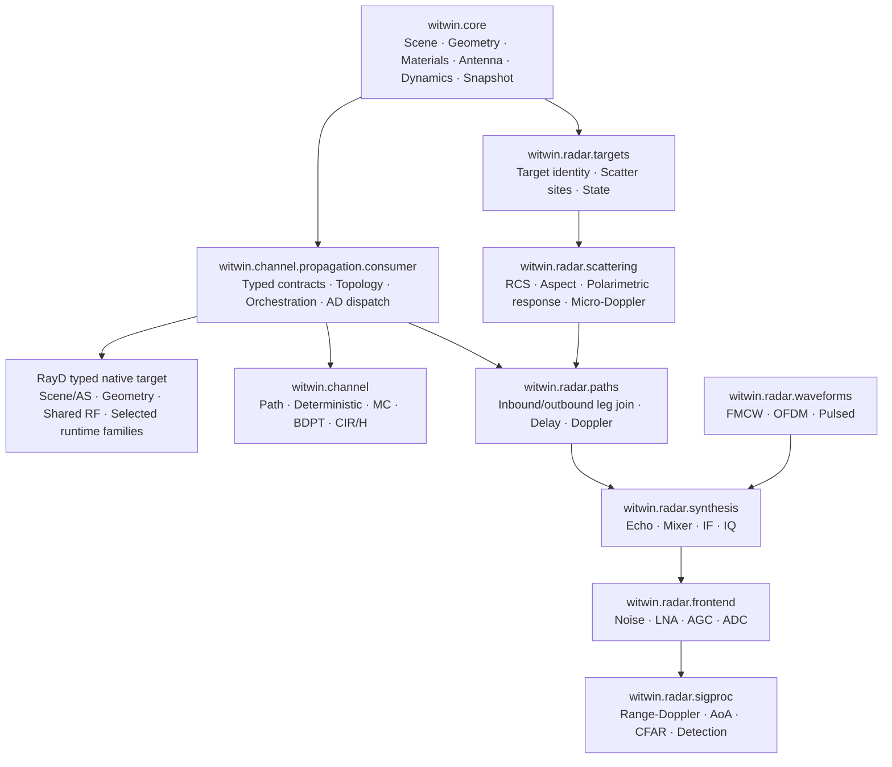

# Radar 消费 `witwin.channel` 传播核心架构与实施计划

状态：大阶段 I 的 Core/Channel production 实现与本地集中验收已完成；Windows RC 已通过
Core+Channel 双 wheel 隔离 smoke；真实 manylinux_2_28 发布门禁待 GitHub Actions 执行；
大阶段 II 尚未开始
适用仓库：`witwin-platform` monorepo
涉及包：`witwin`（`witwin.core`）、`witwin-channel`、`witwin-radar`
目标版本：Core 0.4.0 / Channel 0.4.0 Stage-I RC；Radar 版本由大阶段 II 决定

## 1. 摘要

本计划将 Radar 重构为 Channel 底层传播能力的上层消费者。

Core 负责共享的逻辑世界表示；Channel 负责 Torch-facing propagation contracts、
`CompiledScene`、solver-neutral orchestration、Channel-owned fused operations 和 fixed-topology
AD dispatch；RayD 通过 `_channel` 唯一的 typed C++ integration boundary 拥有 scene/AS/
OptiX、通用 geometry 以及 ADR-024/025/026 已迁入的 RF numerical families；Radar 在传播结果
之上负责目标散射、双程路径组合、Doppler、波形调制、接收机和雷达信号处理。

核心依赖关系为：

```text
witwin.core
        ↓
witwin.channel.propagation.consumer
        ├──→ witwin.channel
        └──→ witwin.radar
```

Radar 不是 Channel 的第五个 solver，也不调用 `path.solve()`、`deterministic.solve()`、MC Basic 或 BDPT 的公共 solver 接口。Radar 只消费经 ADR 批准的 propagation consumer API 和共享的 scene runtime；它不直接消费现有 internal `EvaluatedPaths`，也不把 `evaluate_enumerated_paths()` 当成通用 Radar 入口。

### 1.1 当前 Channel 基线与 Plan 13 的角色

Channel
[`Plan 13`](../../../../channel/docs/dev/plans/13-direct-rayd-integration-and-rf-runtime-ownership-plan.md)
已经完成 Channel 与 RayD 之间的 typed native integration 和 RF numerical-owner 迁移：
删除历史 `RayDN/raydn`、整数 scene handle、getter/extern-C bridge，使 `_channel` 直接
source-link 锁定的 RayD typed target，并按 operation family 冻结 RayD 与 Channel 的 numerical
owner。Plan 13 不再是本计划的开放实施项或证据关闭项；它不是 Radar consumer API 的设计文档，
也不要求后续消费者激活其历史实验分支。

本文只继承当前生产实际使用并已接受的 ADR-023～028、ADR-032 和 ADR-033：

- `_channel` source-link 锁定的 RayD target，并通过稳定的
  `rayd/torch/integration.h` typed C++ API 调用；不得构建、加载或动态查找 RayD Python
  extension、第二 dispatcher 或全局/stale RayD binary；
- RayD scene 以 RAII `SceneResource` 跨边界，并由 Python typed holder
  `RayDSceneResource` 持有；`RayDN/raydn` identity、整数 pointer handle、getter/extern-C
  bridge 和 compatibility alias 已删除；
- RayD 是 generic geometry、shared RF device math、resident layer-stack、complete-row
  transmission、pure-wedge 和 17 个 generic scattering runtime contracts 的 numerical source
  owner；Channel 保留 ABI/façade、material/resource lifecycle、topology、policy、fused solver
  operations、accumulation 和 results；
- ADR-032 的 compact `O(K)` cardinality boundary 是唯一 production-authoritative 路径；
  允许为真实 device-selected row count 执行少量、显式、可审计的整数 D2H 和同步，以建立
  与实际有效路径数成比例的输出；性能判断以端到端 latency、steady throughput、peak memory
  和并发 headroom 为准，而不是以“同步次数绝对为零”为局部目标；
- count D2H 只能服务 shape/allocation/control boundary，不得传输物理 payload、在 CPU 执行
  数值计算或形成 fallback；consumer projection 不得在现有 compact boundary之外增加第二次
  cardinality observation；
- 固定深度 traversal 等内部 operation 继续使用各自已接受的 typed failure transaction，
  但 internal failure state、dormant capacity experiment 和 solver tape 均不成为公共 consumer
  contract。

本文依赖的规范记录为：

- [ADR-023 direct RayD typed integration](../../../../channel/docs/dev/standards/adr-023-direct-rayd-typed-integration.md)；
- [ADR-024 shared RF/transmission ownership](../../../../channel/docs/dev/standards/adr-024-shared-rf-transmission-ownership.md)；
- [ADR-025 diffraction operation-family ownership](../../../../channel/docs/dev/standards/adr-025-diffraction-operation-family-ownership.md)；
- [ADR-026 generic scattering runtime ownership](../../../../channel/docs/dev/standards/adr-026-rayd-generic-scattering-runtime-ownership.md)；
- [ADR-027 batched segment penetration](../../../../channel/docs/dev/standards/adr-027-batched-segment-penetration.md)；
- [ADR-028 device-resident diffraction state selection](../../../../channel/docs/dev/standards/adr-028-device-resident-diffraction-state-selection.md)；
- [ADR-032 controlled compact cardinality boundary](../../../../channel/docs/dev/standards/adr-032-controlled-compact-cardinality-boundary.md)；
- [ADR-033 Channel replacement product identity](../../../../channel/docs/dev/standards/adr-033-channel-replacement-product-identity.md)。

ADR-029 已被 ADR-032 取代（Superseded）；ADR-030 是 Dormant experiment；
ADR-031 已 Rejected。三者可以作为历史测量和反例材料保留在 Channel
仓库，但不属于本文的 implementation dependency、public contract、release gate 或 Stage-I
验收要求。本文不激活 `SourceLane` reducer，不要求公开 C/M/Qr，也不以已被拒绝的
pair-major capacity pipeline 阻塞 Radar 集成。

本文保留轻量且不可跳过的 **Phase 0A**，但它只负责把已完成的 Plan 13 production
architecture 重新绑定到 RayD/`rayd-torch` 0.7.0 稳定发布：冻结最终 release SHA、
`rayd/torch/integration.h` identity/API/hash、Channel lock、source manifest、build fingerprint
和当前 compact owner。历史 P→E/E→M 比较不再作为待补 evidence debt，也不触发 Plan 13
重验收；Phase 0A 只验证 0.7.0 dependency/build/ABI compatibility，完整四 solver、AD、性能和
release 验收集中在后续大模块 checkpoint。

### 1.2 Hard-guardrail audit 结论

本计划的领域边界、双扩展所有权、无 fallback、fixed-topology AD、资源不进入 Result、row identity 和 native fusion 原则与 Channel 的硬性架构要求一致，但以下四项在现行规则下是**有条件成立**，不能以普通实现 PR 偷渡：

1. Channel 现行 ADR-003 只承诺 package root 和四个 solver 为稳定 public API；ADR-007 明确 `EvaluatedPaths` 是 internal contract。因此不能把它直接 re-export 成 Radar 依赖的跨包稳定 SPI。必须新建窄而版本化的 consumer contract，或先用新 ADR 正式修改 public/internal 边界。
2. Channel 当前稳定 root API 和 guardrail 仍把 `Scene`、`Structure`、endpoint/material contracts 归 Channel。将逻辑 Scene 上移到 Core 是目标 owner move，不是当前事实；必须通过 ADR、public API snapshot、import graph 和 `AGENTS.md`/`CLAUDE.md` 同步更新后才能实施。
3. 新 consumer contract 必须原生采用 ADR-032 compact `O(K)` 语义，并复用现有受控
   cardinality observation；不得重新激活 dormant pair-major capacity pipeline，也不得为了
   consumer schema再增加一次 count D2H/sync。
4. propagation consumer 在 Channel boundary 完成 compact result assembly 和错误观察后返回。
   Radar downstream kernel 消费普通 typed tensors；不跨包传递 internal
   failure state、raw failure bit、native handle 或 solver tape。

此外，Radar 从本计划起采用新的生产计算政策：

- Radar 不再以 Dr.Jit/RayD Dr.Jit bridge 作为生产后端；
- 从 `CompiledScene`/snapshot 进入传感器计算后，tracing adapter、direct echo、target scattering、two-way join、Doppler、waveform/IQ 和其 AD companion 由 Channel native propagation 或 `_radar_native` CUDA owner 执行；
- Torch 只用于 API/orchestration、metadata-only structural packing、tensor/result assembly、tests/reference，以及经单独 DSP policy 批准的 vendor-library primitive；
- 缺少 native capability 时 fail loudly，不退回 Dr.Jit、Torch physics、Python ray tracing 或旧 tracer。

### 1.3 Channel 硬性要求符合性矩阵

| Channel 硬性要求 | 本计划状态 | 强制处理 |
|---|---|---|
| 唯一 production backend 为 native CUDA/RayD | 符合 | Channel propagation 走 owning native facade；Radar physics/synthesis 走 `_radar_native` |
| 无 CPU/Torch/legacy Dr.Jit fallback | 符合 | negative static/runtime tests；missing capability fail loudly |
| Python/Torch 只做边界与结构工作 | 符合，DSP 有窄例外 | physics hot paths 原生化；vendor FFT 例外由 Radar compute-policy ADR 固定 |
| native primal/JVP/VJP/backward companion | 符合 | Stage I Phase 3 验证 propagation AD；Stage II Phase 4 做 Radar 纵向 spike，Phase 5-9 完整覆盖 |
| raw extension 只在 owning facade | 符合 | Radar 不直接 import `_channel`；每个 Radar op 只有一个 facade owner |
| typed contracts 保持 row identity/storage/stride/device/grad | 符合 | consumer contract zero-copy；需要新 schema 的字段由 owning native producer一次生成，不从 internal rows 重算 |
| device-selected cardinality | 符合，需冻结 SPI | 复用 ADR-032 compact `O(K)` boundary；允许受控整数 D2H/sync，不新增第二次 count observation |
| solve-owned failure transaction | 符合 | transaction 留在 Channel internal owner；consumer result 不暴露 state/bit/handle |
| Results 不持有 Scene/CompiledScene/native resource/cache | 符合 | runtime resource 仅作显式输入；默认不跨 extension 传 resource |
| package root + 四 solver 是当前稳定 public API | **需 ADR** | Scene owner move和 consumer API 在 Phase 0 先更新 ADR-003/snapshot/guardrails |
| `EvaluatedPaths` 是 internal contract | **已纠正** | 不公开/不 re-export；新增窄 `PropagationPathBatch` consumer view |
| enumerated engine 仅 Path/Deterministic + BDPT 命名例外 | **已纠正** | Radar 不调用 `evaluate_enumerated_paths()`；新 general service 需 ADR |
| fusion owner 按 ABI/launch/tape/数值顺序 | 符合 | composition-first；只有 profiling + ADR 才跨资源边界 fusion |
| RayD/Channel numerical owner split | 符合，需全文同步 | RayD 保持 ADR-024/025/026 owner；Radar 不复制 RF/geometry numerical source |
| packaged extension、无 silent JIT/stale binary | 符合 | Phase 10 收敛 `_radar_native` loader 和 fingerprinted developer override |
| 架构 guardrail 变更同步 AGENTS/CLAUDE | 符合 | Phase 0 acceptance 明确要求两文件逐字同步 |

因此结论不是“现有计划无需修改即可开工”，而是：**完成本文标出的 Phase 0 ADR 后符合；在 ADR 批准前，Scene owner move和跨包 consumer API 不得进入生产。**

这一设计属于完整的软件架构，具体包含：

- 分层架构：world、propagation、sensor synthesis、frontend、processing；
- 领域所有权架构：Channel 与 Radar 分别拥有自己的求解目标和结果语义；
- 依赖架构：Radar 单向依赖 propagation core，不与 Channel solver 相互依赖；
- 数据契约架构：传播路径、散射点、双程路径和 synthesis 输入均为 typed contracts；
- Native 架构：默认使用 typed-tensor composition；RayD public device primitives 只由其既有
  owner 使用，任何跨扩展共享 object/static library 都必须由独立 ADR 证明不形成第二 numerical
  owner；
- AD 架构：传播、目标散射和波形合成的导数按层组合。

## 2. 架构目标

### 2.1 主要目标

1. Radar 复用 Core 的逻辑 Scene，并通过 Channel façade 复用 CompiledScene、
   RayD/BVH、Material ABI/resource 与 RayD/Channel 已冻结 owner 的传播能力。
2. 消除 Radar 与 Channel 之间重复的 mesh loader、材料编码、RayD scene 和 BVH 生命周期。
3. 建立经 ADR 批准、solver-neutral 的 propagation consumer API。
4. 在 Radar 内建立显式的 target、two-way path、Doppler 和 echo synthesis 层。
5. 保留 `_channel` 与 `_radar_native` 两个独立扩展和独立 binding owner。
6. 支持固定拓扑下从传播几何到 Radar loss 的 JVP/VJP/backward 链。
7. 迁移期间不把架构变化和物理模型变化混在同一提交或同一验收基线中。
8. 保留并原生化 Radar direct illumination 快速路径，使 direct target echo 不必经过 Channel general multipath enumeration。
9. 在 production cutover 前移除 Radar 对 `drjit`、`rayd.drjit`、`@dr.wrap` 和自有 RayD bridge 的运行时依赖。
10. 从第一个 consumer contract 起复用 Channel 的 compact `O(K)` cardinality boundary；
    Radar-owned site/join/pruning 也允许少量、显式、受性能预算约束的整数 count D2H/sync，
    但不得把 physics payload 搬到 host、执行 CPU physics 或形成隐式 fallback。

### 2.2 非目标

本计划的交付目标是完整最终架构。执行范围覆盖 shared Scene、全部双程传播、Dynamics、Radar synthesis、AD、Native packaging、旧实现删除和 release acceptance，不以静态或单一传感器场景替代最终验收。

以下内容不属于本架构计划：

- 把 Radar 注册为 Channel solver；
- 将 waveform、ADC、CFAR 或 Range-Doppler kernel 放入 `_channel`；
- 立即创建庞大的 `witwin.world` 通用框架；
- 在架构迁移提交中改变现有 Radar 幅度标定、相位约定或检测结果；
- 提供 CPU、Torch physics 或 Python ray-tracing fallback；
- 通过调用两次 Channel 公共 solver 并拼接其 `Result` 来构造双程路径。

## 3. 目标分层与所有权



### 3.1 Core Scene 所有权

`witwin.core` 在 ADR 批准后的最终状态拥有逻辑世界和公共 Scene 数据模型：

- geometry 和 mesh topology；
- physical material；
- antenna geometry 和 orientation；
- structure/object identity；
- trajectory、rigid motion、mesh deformation；
- scene snapshot 和版本；
- compile/cache invalidation 所需的逻辑版本和稳定 object identity；这些值不得编码 native
  pointer、scene handle 或 ABI resource。

Core 的 `PhysicalMaterial` 是逻辑物理参数 contract，不是 CUDA material ABI owner。
Channel 的 `materials` 继续拥有：

- material ABI encoding/version；
- GPU parameter layout 和 stores；
- layer CSR/resource、validation、cache 和 typed kernel façade；
- material primal/JVP/VJP dispatch contract。

RayD 继续作为 ADR-024/026 指定的 shared complex/Fresnel/Jones/layer-stack 与 generic
scattering runtime numerical source owner。Channel façade通过 `_channel` 的稳定 ABI
dispatch这些 typed RayD entries；不得因 Core owner move 将 numerical source 移回 Channel，
也不得在 Radar 重建一份 Fresnel/slab/roughness implementation。

这一区分避免两套物理材料数据模型，同时不把 native ABI、数值顺序或 kernel owner 错误上移到轻量 Core。

`witwin.core` 不拥有编译后的传播运行时资源。以下内容留在 `witwin.channel`：

- `CompiledScene`；
- RayD scene 和 BVH/acceleration structures；
- geometry/material/assignment GPU stores；
- propagation workspaces、typed `RayDSceneResource` 和 caches；
- topology discovery 与 field evaluation runtime。

因此最终编译关系固定为：

```text
witwin.core.Scene / SceneSnapshot
        ↓
witwin.channel.scene.compile(..., reference_frequency_hz=...)
        ↓
witwin.channel.CompiledScene
```

Channel 和 Radar 共享 `witwin.core.Scene`，并通过 Channel propagation runtime 消费同一种
`CompiledScene`。Core distribution 可以继续拥有现有 mesh-SDF CUDA capability，但新增的
world-contract modules（Scene、Material、Antenna、Dynamics、Snapshot）不得导入或加载
RayD、Channel、Radar 或 native/CUDA runtime，从而避免 `core -> channel -> core` 循环。

共享层不得依赖：

- Channel solver；
- Radar target/RCS；
- waveform、receiver、ADC；
- CFAR 或检测结果。

迁移按完整 owner move 执行：先接受改变 Channel 当前稳定 Scene owner/public identity 的 ADR，再在 Core 建立最终 Scene/Snapshot contract，将 Channel compiler 和 Radar caller 切换到它，最后删除 Channel 与 Radar 中重复的逻辑 Scene model。若需要保留 `witwin.channel.Scene` 的 public identity，只能由同一 Core class 的受控 root re-export 完成，并由 public API snapshot 明确记录；不得长期保留第二个实现或双向 adapter。

### 3.2 Propagation core 所有权

Channel propagation domain 拥有：

- logical Scene 输入的 validation/compile boundary、`CompiledScene` 和 RayD scene lifecycle；
- geometry/material/assignment GPU stores；
- LoS、reflection、transmission、diffraction、scattering 的 typed façade、row contract、
  orchestration 与 Channel-retained composed operations；
- discrete topology 和 continuous geometry；
- path length、delay、AoD/AoA、interaction positions/normals；
- Complex3/Jones transport；
- material/frequency/geometry field evaluation contracts；
- fixed-topology reevaluation、JVP 和 VJP；
- typed, zero-copy propagation contracts。

这里的 domain owner 不覆盖底层 numerical source owner。最终 numerical split 固定为：

| Operation family | Numerical source owner | Channel 保留内容 |
|---|---|---|
| scene/AS/OptiX、intersection、visibility、generic path geometry | RayD | typed façade、request/result contract、orchestration |
| shared RF device math、layer-stack、transmission sequence | RayD | Material ABI/CSR/resource、field façade、topology/result |
| pure-wedge fixed-winner primal/JVP/VJP | RayD | stable `_channel` ABI、field/autograd façade |
| generic scattering 17-family runtime | RayD | table/phase-screen lifecycle、facade、event/topology policy |
| coupled R-D/D-D、MC Sionna、BDPT state/estimators | Channel | complete fused primal/JVP/VJP owner |
| compact selection/packing、solver accumulation/result | Channel | complete operation owner |

新增 consumer service 必须组合这些既有 owners。它可以成为新的 Channel-owned composed ABI，
但不能复制 RayD numerical implementation、拆分既有 fused family 或创建 Radar-side geometry/RF
backend。

Propagation core 不拥有：

- Radar target identity；
- RCS 或 Radar target scattering policy；
- monostatic/bistatic/multistatic sensor policy；
- chirp/frame、fast-time、slow-time；
- IQ、ADC、Range-Doppler、CFAR；
- Channel-specific CIR/H-matrix result assembly。

### 3.3 Channel 所有权

Channel solver 负责将 propagation evaluation 转换为：

- `PathResult`；
- deterministic field/power；
- CIR、CFR、H-matrix；
- Monte Carlo 和 BDPT estimator 结果；
- Channel solver metadata 和 diagnostics。

Channel solver 不向 Radar 暴露其内部结果作为传播 SPI。

### 3.4 Radar 所有权

Radar 负责：

- sensor topology：monostatic、bistatic、multistatic；
- target identity、target state 和 scatter-site selection；
- point target、extended target；
- RCS、aspect-dependent 和 polarimetric target response；
- inbound/outbound leg pairing；
- double-trip delay、phase、delay rate 和 Doppler；
- micro-Doppler；
- waveform、mixer、IF、IQ；
- noise、receiver chain、ADC；
- Range、Range-Doppler、AoA、CFAR、检测和跟踪接口。

## 4. 依赖规则

### 4.1 允许的依赖

```text
core world contracts -> no solver/native runtime dependency
witwin.channel.scene -> core contracts
witwin.channel.propagation.consumer -> scene/runtime/materials
_channel C++ boundary -> locked rayd/torch/integration.h + Channel-retained kernels
channel solvers -> internal propagation owners
radar propagation adapter -> witwin.channel.propagation.consumer
radar two-way composer -> radar targets + propagation contracts
_radar_native -> Radar-owned typed tensors/contracts only
radar synthesis -> radar two-way contracts + waveform
radar processing -> radar signal tensors
```

### 4.2 禁止的依赖

```text
radar -> witwin.channel.path
radar -> witwin.channel.deterministic
radar -> witwin.channel.montecarlo
channel solver -> radar
witwin.channel.propagation.consumer -> radar
core -> channel or radar
core world contracts -> RayD/Channel/Radar/native resources
radar -> raw _channel extension
channel -> raw _radar_native extension
_radar_native -> RayD scene/RF owners or Channel private native symbols
RayD -> Channel private headers
```

Radar 必须通过 propagation Python facade 消费 native 能力，不得直接调用 `_channel` symbol。

### 4.3 Distribution 依赖

目标状态：

```text
witwin-radar
  depends on witwin-channel
  depends on witwin (`witwin.core` contracts)
```

迁移期使用显式 extra，例如 `witwin-radar[channel]`，并由显式 backend/config 启用；依赖缺失或 native failure 时直接报错，不静默退回旧 tracer。Phase 11 cutover 后改为 mandatory dependency。

当前必须解决的兼容性差异：

- Radar 当前声明 Python `>=3.10,<3.15`；
- Channel 当前声明 Python `>=3.11,<3.12`；
- Channel 当前固定 Torch `2.10.0`；
- Radar 当前允许更宽的 Torch/Python 组合。

明确推荐：**不要仅因 Channel 当前只声明 Python 3.11 就把 Radar 收窄到 3.11。优先扩展 Channel，使其覆盖 Radar 实际发布矩阵。**

执行决策：

1. 目标 Python matrix 先按 Radar 当前声明的 `>=3.10,<3.15` 进行 feasibility/build smoke；
2. 首个集成 release 的 Torch ABI 先统一锁到当前 Channel 已验证的 `torch==2.10.0`，不要同时扩大 Python 和 Torch 两个维度；
3. Phase 0 必须在 Python 3.10、3.11、3.12、3.13、3.14 上验证 Torch/RayD/compiler/native wheel 的实际可用性；
4. 如果某个 Python 版本被上游 Torch/RayD 明确阻塞，必须在 Phase 1 前通过独立 breaking support decision 从 Radar matrix 移除，而不是被 mandatory dependency 被动挤掉；
5. Phase 1-10 期间 Radar 当前发布不被未完成的 Channel wheel matrix 阻塞，channel backend 通过 explicit extra 使用；
6. Phase 11 只有在 Channel 与最终 Radar matrix 完全一致时才能改为 mandatory dependency；
7. 后续扩展 Torch minor versions 作为 packaging capability 工作，不与 Scene/propagation 架构迁移混合。

> **执行结果（2026-07-25）**：Core 已扩至 `>=3.10,<3.15`（跟随 RayD 0.7.0，
> Stable ABI 扩展）；Channel 维持 `>=3.11,<3.12`。Radar 无需收窄；其
> `witwin` pin 提升至 `>=0.4,<0.5` 即可消费 Stage-I Core。

这一路线保留 Radar 的用户支持目标，同时把 native ABI 风险限制在一个 Torch 版本。若全 Python matrix 的 feasibility gate 失败，计划会在写 Core contracts 前得到明确 stop/go 结论。

## 5. 共享 Scene 与材料模型

### 5.1 Structure 组合

目标概念模型：

```text
Structure
├── Geometry / Mesh                  shared
├── PhysicalMaterial                shared
├── Dynamics                        shared
└── RadarTargetProperties           radar-only association
```

`RadarTargetProperties` 不应成为 Channel scene 的必需字段。推荐由 Radar 使用 `structure_id` 建立外部关联：

```python
RadarTarget(
    structure_id=structure_id,
    scattering=RCSModel(...),
    target_state=TargetState(...),
)
```

这样同一个 Structure 可以：

- 作为 Channel 中的普通传播环境；
- 作为 Radar 中的目标；
- 同时作为环境 clutter source；
- 不污染共享 physical material ABI。

### 5.2 Physical material

共享 physical material 至少表达：

```python
PhysicalMaterial(
    eps_r=...,
    sigma_e=...,
    mu_r=...,
    thickness_m=...,
    layers=...,
    roughness=...,
    dispersion=...,
    gain=...,
    scattering_coefficient=...,
    xpd_coefficient=...,
)
```

它拥有传播相关的、solver-neutral 的电磁与表面响应参数，不拥有 RCS。Channel 当前 exact
行为使用的 `gain`、`scattering_coefficient` 和 `xpd_coefficient` 必须进入 Core logical
specification，不能在 Phase 2 删除旧 material owner 时丢失，也不能变成 Channel 私有默认值。
`PhaseScreen` 的逻辑 descriptor、height/correlation 和 surface-assignment identity同样由Core
表达；其CUDA layout、resident texture/table、cache和evaluation façade仍由Channel拥有。

Radar target response 可以读取 physical material，但必须是额外的 Radar 模型：

```python
class RCSModel:
    def evaluate(self, incident, outgoing, frequency_hz, target_state):
        ...
```

禁止重新创建一套带 `eps_r/sigma_e/mu_r` 的 `RadarMaterial`。

### 5.3 Scene owner 的最终决策

最终 owner 不再保留为开放选项：

| 内容 | 最终 owner | 原因 |
|---|---|---|
| `Scene`、`Structure`、geometry contracts | `witwin.core` | Channel、Radar 和其他 solver 共同描述同一世界 |
| Physical material specification 与 logical assignments | `witwin.core` | 避免两套物理参数模型和 structure/material identity |
| Material ABI encoding、GPU layout、resource/façade/AD dispatch | `witwin.channel.materials` | 与 Channel typed contract、stores 和 `_channel` ABI 绑定 |
| shared RF、layer-stack、transmission 与 generic scattering numerical source | RayD | ADR-024/026 已冻结并生产激活的唯一 source owner |
| TX/RX/antenna logical state | `witwin.core` | 属于世界与设备状态，不属于某个 solver |
| Dynamics、trajectory、`SceneSnapshot` | `witwin.core` | Channel 与 Radar 都需要一致时间状态 |
| Scene version/invalidation tokens | `witwin.core` | 所有 compiler 消费同一版本语义 |
| `CompiledScene` | `witwin.channel` | 是 propagation runtime 的编译产物 |
| RayD scene、BVH、typed `RayDSceneResource` holder | Channel façade；RayD resource owner | 依赖 CUDA/RayD，不能让 Core 变成重型 runtime或暴露 pointer handle |
| geometry/material/assignment GPU stores | `witwin.channel` | 与 propagation ABI、kernel 和 cache 生命周期绑定 |
| Radar target/RCS association | `witwin.radar` | 属于传感器语义，不是物理世界基础材料 |

迁移路径：

```text
Current core Structure + Radar Scene + Channel Scene
        ↓ establish final Core Scene contracts
witwin.core.Scene / SceneSnapshot
        ↓ witwin.channel.scene.compile(..., reference_frequency_hz=...)
witwin.channel.CompiledScene
        ├── Channel propagation/solvers
        └── Radar propagation consumer
```

Core Scene/Snapshot 不拥有 carrier/reference frequency。Channel compile boundary显式接收
`reference_frequency_hz`，并以 snapshot versions、material specification versions和该频率共同
形成cache key；`CompiledScene`冻结该primal reference frequency及其frequency-dependent material
records。`PropagationRequest.reference_frequency_hz`必须与CompiledScene一致，否则在compute前
fail loudly。`frequency_offsets_hz`仅在capability明确支持时使用；Stage I不以隐式重编译或
host-side material replay伪装wideband dispersive支持。

迁移要求：

- vertices 保留 tensor identity 和 gradient state；
- faces、material IDs、object IDs 和 assignment IDs 稳定；
- 不通过 NumPy、DLPack 或 CPU staging；
- 同一 snapshot 不建立第二个 production RayD scene/BVH；
- logical material specification 有一个 Core owner；native material encoding/ABI/resource 有一个
  Channel owner；ADR-024/026 numerical families 保持一个 RayD source owner；
- scene invalidation 由 Core 的 topology/geometry/material/assignment versions 驱动；
- Channel compiler 可以缓存编译结果，但 cache/typed native resource 不回写进 Core Scene；
- Radar 不直接管理 CompiledScene internals，只通过 propagation facade 使用；
- owner move 完成后删除 Radar Scene compiler 和 Channel 重复 logical Scene model；
- owner move 前必须显式批准对 ADR-003、public API snapshot、root exports、import graph 和 Channel guardrails 的变更。

### 5.4 Channel Scene 当前成熟度与进入条件

`witwin.channel.scene.__init__` 有意不导出 public symbols，但不能据此判断 scene runtime 为空。
Plan 13 完成直接集成后，当前代码已经存在：

- `scene/compile.py` 中的 canonical compile pipeline；
- `scene/compiled.py::CompiledScene`；
- Geometry/Material/Assignment GPU stores；
- `scene/kernels/rayd_scene.py::RayDSceneResource` typed holder、RayD RAII `SceneResource` 和
  native scene creation；
- material ABI v3、scattering resources、compile cache 和 version invalidation；
- Path/Deterministic/MC/BDPT 对这些 runtime resources 的真实调用。

因此 Phase 1-2 的性质是：

```text
existing Channel runtime ownership
+ duplicated logical Scene models
+ unpublished scene facade
        ↓
Core logical Scene extraction
+ Channel compiler owner consolidation
+ stable compile boundary
```

不是从零实现 BVH 或 CompiledScene。

Phase 1 启动前仍必须执行 maturity audit，确认：

- CompiledScene 的真实 callers 和 lifecycle；
- `RayDSceneResource`/BVH 构建、typed borrow 与复用路径；
- geometry/material/assignment stores 的 canonical owners；
- cache key、invalidation 和 mutable state；
- logical Scene 与 runtime Scene 的兼容 façade/debt；
- Channel 四 solver 对 Scene internals 的 import edges；
- 当前 runtime tests、performance baselines 和 missing contract coverage。

Maturity audit 还必须确认已完成的 Plan 13 production architecture在RayD 0.7.0 final上保持：
live source 中 `RayDN/raydn`、integer handle、legacy extern-C/getter bridge和compatibility
aliases为零；0.7.0 lock、integration header identity/API/hash、binding manifest与
current-owner inventory一致。若任一项未满足，停止本文Phase 1，不得围绕过渡边界设计
consumer API，也不得把问题描述为“继续完成Plan 13”。

若 audit 发现 runtime owner 与上述现状不符，必须先更新 ADR 和 Phase 2 scope；不得基于 `scene.__init__` 是否导出符号来推断底层能力。

## 6. 稳定 Propagation Consumer API

### 6.1 设计原则

Propagation consumer API 是新的跨包稳定 contract，不是 internal `EvaluatedPaths` 的别名，
也不是 Path/Deterministic Result 的裁剪版。它必须：

- 与任何 Channel solver Config/Result 解耦，只输入 endpoint batches、传播 policy 和
  capability request；
- 从第一个版本起采用 ADR-032 production-authoritative compact `O(K)` rows，其中 K 是实际有效
  路径数，不是 provisioned capacity；
- 保留 GPU residence、canonical row identity/order、dtype/device/stride 和 gradient state；
- 复用 owning native compact stage 已有的 cardinality observation，不因 consumer schema增加
  第二次 count D2H/sync、Python/Torch Boolean compaction 或 physics gather；
- 明确 units、phase、field/transport、reference frequency、primal/JVP/VJP 和 unsupported
  combinations；
- 明确 compact boundary、错误观察和跨包边界；internal fixed-capacity operation 的 failure
  transaction 不进入 public API；
- 只消费现有 RayD/Channel owner，不复制 geometry、RF、material、diffraction 或 scattering
  numerical source；
- 不持有 mutable Scene cache、`RayDSceneResource`、native pointer/lease 或 solver tape；
- 不包含 Radar target、waveform、RCS、join、ADC 或 processing 字段。

### 6.2 Compact request

建议入口：

```python
evaluation = propagation.evaluate(
    compiled_scene,
    PropagationRequest(
        sources=source_endpoints,
        sinks=sink_endpoints,
        reference_frequency_hz=77e9,
        frequency_offsets_hz=None,
        components=frozenset({"los", "reflection"}),
        max_depth=2,
        response="polarimetric_transport",
        topology_mode="discover",
        ad_mode="none",
        max_paths=None,
    ),
)
```

> **状态（2026-07-25）**：contract v2 已删除 `frequency_offsets_hz` 字段
> （窄带律由 convention 声明、`delay_s` 支撑调用者自施）；词汇表以
> `Literal` 别名 + `capabilities()` 发布；请求在构造期自校验。以下 schema
> 为规划期原文。

```python
@dataclass(frozen=True, slots=True)
class PropagationRequest:
    sources: EndpointBatch
    sinks: EndpointBatch
    reference_frequency_hz: float | torch.Tensor
    components: frozenset[str]
    max_depth: int
    response: str
    topology_mode: str
    ad_mode: str
    frequency_offsets_hz: torch.Tensor | None = None
    max_paths: int | None = None
```

`max_paths` 是显式 canonical selection/truncation policy；它不是 allocation capacity，也不能
从临时 workspace 大小推导。C、M、Qr 不属于 public request。Channel 内部仍可为 traversal、
fixed-depth tape 或其他真正 fixed-capacity operation 使用 host-known limits，但这些 limits 由
其 canonical owner 定义和验证，不传播到 consumer schema，也不改变 compact result 的 K-row
语义。

不得加入 chirp count、ADC samples、target RCS、monostatic policy、Range-Doppler 或 CFAR 参数。
入口可以接受显式 `CompiledScene`，也可以由 `SceneSnapshot` 驱动 compile/cache orchestration；
hot path 不得重复 compile。

### 6.3 Compact result contract

```python
@dataclass(frozen=True, slots=True)
class PropagationPathBatch:
    pair_count: int
    path_count: int
    pair_index: torch.Tensor  # CUDA int64 [K], stable sink-major/source-minor
    pair_offsets: torch.Tensor  # CUDA int64 [pair_count + 1]
    topology: PropagationTopology
    geometry: PropagationGeometry
    transport: PropagationTransport

@dataclass(frozen=True, slots=True)
class PropagationEvaluation:
    paths: PropagationPathBatch
    convention: PropagationConvention
    capabilities: PropagationCapabilities
    diagnostics: PropagationDiagnostics
```

K 等于所有公开 row tensors 的真实第一维；公开 batch 中不存在 padding/invalid row。
`path_count` 等于 K，并由 owning compact boundary 已经观察到的 host count构造，不触发新的
device read。`pair_index` 和 `pair_offsets` 给出稳定 sink-major/source-minor segmentation，
其中 `pair_index = sink_index * source_count + source_index`；它们不得通过
Python host loop从 physics payload 重建。所有 topology、geometry 和 transport fields 按同一 K
对齐，保持 row identity、tensor storage/stride、device 和 gradient state。

Consumer output projection 必须在 owning native/typed propagation owner 内完成，并复用当前
compact stage。禁止在 Python/Torch 中进行第二次 Boolean compact、physics index/gather 或
numerical recompute。真正的 overflow、native failure 或 unsupported capability必须 fail loudly，
不得 silent truncate 或发布 partial evaluation。

受控 D2H/sync 规则：

1. 只允许读取建立 compact shape 所需的整数 cardinality/control metadata，不允许读取物理
   payload、IDs、field 或 geometry 做 CPU 决策。
2. 每个 boundary 的 D2H bytes、同步位置、launch/copy count必须进入性能 ledger。
3. consumer façade不得仅为改 schema增加第二次 cardinality read；若必须改变 boundary，先用
   E2E latency、throughput、peak-memory 和并发 evidence 接受新的 owner。
4. 减少同步不是独立目标；若更少同步导致 `O(N)` memory amplification或端到端性能下降，应
   保留较快的受控 compact boundary。

### 6.4 Internal mapping 与 transaction boundary

`PathTopology`、`PathGeometry`、`PathFields` 和 `EvaluatedPaths` 继续是 ADR-007 internal
contracts，Radar 不得 import defining modules。被 supersede、dormant 或 rejected 的实验同样
保持 caller-free/internal，不是 consumer 实现依赖。

Consumer schema 对已有完全同义、同布局字段采用 metadata-only alias；缺失的 endpoint
basis/Jones/interaction 字段由唯一 owning native producer 在 source pipeline 中一次生成。
禁止 Python/Torch 重算，禁止为了声称 zero-copy 而把 internal schema、failure object或
solver tape直接公开，也禁止无必要的 clone/contiguous/device transfer。

错误和 internal fixed-capacity transaction 由 Channel 在 propagation boundary 内终结。
Consumer 只返回普通 typed tensors和不可变 metadata；不会向 Radar 传递
internal failure state、raw failure bit、native pointer/lease 或 error-observer ownership。
Radar 后续 kernel在调用者当前 stream 上消费已完成组装的 compact result。

### 6.5 Path transport 语义

现有 Channel endpoint-projected scalar coefficient 不足以在目标处插入一般 polarimetric
scattering operator。Consumer transport contract 必须显式区分：

1. scalar transfer；
2. Complex3 vector transport；
3. Jones 2x2/source-basis-to-sink-basis linear operator。

最终 release 必须覆盖三种 capability；任一中间 release 只可通过 typed capability matrix
声明已实现组合。缺少 polarimetric capability时 fail before compute，不能退化为 scalar，不能
fabricate transmitter polarization，也不能从 Deterministic ReceiverGrid diffraction sidecar
重建 target transport。

### 6.6 相位与 reference frequency

必须在 ADR 中冻结 coefficient 和 delay 的组合。推荐形式：

```text
H_p(f) = C_p(f_ref) · exp(-j 2π (f - f_ref) τ_p)
```

- `C_p(f_ref)` 明确是否包含 `f_ref` 处传播相位；
- `tau_p` 表示几何/群时延；
- Radar synthesis 只补偿相对 `f_ref` 的波形频率变化；
- Channel/RayD transport 与 Radar kernel 不得重复添加 carrier phase、FSPL、antenna factor；
- material phase、free-space phase、source excitation 和 sink projection 各有唯一 owner；
- compiled frequency-dependent material records 的 frequency AD 受现有 capability 限制；不支持的
  frequency tangent 必须 fail，不能把“layer-stack kernel有 frequency companion”误写成所有
  compiled material 都可对频率求导。

如果最终选择 phase-free transport coefficient，可以在 ADR 中选择另一形式，但生产只能有一个
约定。

### 6.7 跨包 SPI 稳定性与治理

Consumer API 的代码 owner 是经 ADR 批准的
`witwin.channel.propagation.consumer` façade；不是 Channel solver、Radar 或 Core。
Core 只拥有 Scene/Snapshot inputs。
Channel 和 Radar 都是 required compatibility consumers。

稳定性策略：

1. 冻结 units、compact K-row identity/order、pair segmentation、transport、phase、error 与 AD
   semantics，不冻结内部 kernel/fusion。
2. SPI 最小但完整；不用开放字典堆积字段，也不暴露 internal class或 runtime resource。
3. Breaking schema/semantics change 更新 contract version、dependency、API snapshot、migration
   note 和双消费者 CI；不长期维护两套生产 schema或 compatibility shim。
4. Public solver Results 可以独立演化，不能反向决定 consumer schema；consumer 也不能把 Radar
   policy塞进 enumerated owner。
5. 每个 native ABI symbol有唯一 Python façade、current numerical owner、binding/coverage
   manifest、direct contract和至少一个 E2E caller。

Phase 3 exit 前必须完成 ADR-003/007/008/032/033 delta、consumer public snapshot、compact
boundary/sync budget、zero-copy/native-producer provenance matrix、package-neutral conformance
suite、版本映射、breaking removal policy和 clean Stage-I wheels。Radar 接入后再启用
Channel+Radar双消费者 CI。
在这些记录接受前，Radar 不得发布对 internal propagation module 的 mandatory dependency。

### 6.8 与 `propagation.enumerated` 的边界

ADR-008 只允许 Path/Deterministic 使用 shared enumerated engine，并给 BDPT 一个命名、只读、
opaque oracle 例外。Radar 不能成为第二个隐式例外。

- Radar direct evaluator 只消费批准的 native visibility/intersection/leg primitives，不调用
  enumerated engine；
- Radar general multipath 使用新的 solver-neutral consumer service/ABI；新 ADR 明确其与
  enumerated stages、ADR-032 compact owner、row ordering和受控 cardinality observation 的关系；
- 若 service 内部复用 enumerated owner，调用只发生在 Channel propagation owner 内，
  Radar只看到稳定 consumer contract；
- 不新增 Radar → `propagation.enumerated.*` import allowlist，不复制 enumerated physics，不给
  request添加 target/waveform/two-way policy；
- consumer service 不得复用 ADR-008 public oracle 作为未命名 compatibility route，也不得通过
  Path/Deterministic Result 间接取得路径。

## 7. Radar 双程传播架构

### 7.1 ScatterSiteBatch

Radar 首先从目标 geometry 产生散射点：

```python
@dataclass(frozen=True, slots=True)
class ScatterSiteBatch:
    site_count: int
    target_id: torch.Tensor
    site_id: torch.Tensor
    structure_id: torch.Tensor
    primitive_id: torch.Tensor
    position_m: torch.Tensor
    velocity_mps: torch.Tensor
    normal: torch.Tensor
    area_m2: torch.Tensor
    scattering_model_id: torch.Tensor
```

要求：

- `site_id` 在固定 topology/deformation 序列中稳定；
- triangle sampling 使用 primitive identity，不依赖可见像素顺序；
- point target 也使用同一 contract；
- target sampling policy 属于 Radar；
- visibility 和环境传播由 propagation core 负责；
- site axis 是 owning native selector 发布的实际 compact K；`site_count` 与所有 site tensor 的
  第一维一致，不表示 provisioned capacity；
- owning native selector 可以执行一次受控整数 count D2H/sync 来精确分配 `O(K)` 输出；
  禁止 Python/Torch Boolean compaction、host per-site physics loop 或读取 geometry/field payload；
- selector failure必须 fail loudly且不发布 partial site batch；`max_sites` 若存在，是明确的
  Radar selection policy，不是 silent storage truncation。

### 7.2 Radar leg evaluation

逻辑上需要：

```text
inbound:  radar TX -> scatter site
outbound: scatter site -> radar RX
```

经 ADR 批准的 Channel consumer API 应保持 generic，例如 `propagation.evaluate()` 或 `evaluate_legs()`。Radar 可以提供自己的 adapter：

```python
legs = radar.propagation.evaluate_radar_legs(
    compiled_scene,
    tx=radar.tx_endpoints,
    targets=scatter_sites,
    rx=radar.rx_endpoints,
    request=propagation_request,
)
```

若性能需要 fused native operation：

- 通用 endpoint/leg discovery primitive 可以由 propagation native owner 实现；
- target RCS、双程 join 或 waveform-aware fusion 属于 `_radar_native`；
- 不在 `_channel` 注册 waveform、IQ 或 ADC 操作；
- 不因 Python 目录层次强行拆开已有 fused kernel。

### 7.3 Leg identity

双程组合必须保留：

```python
RadarLegTopology(
    tx_id=...,
    rx_id=...,
    target_id=...,
    scatter_site_id=...,
    inbound_row=...,
    outbound_row=...,
    inbound_primitive_sequence=...,
    outbound_primitive_sequence=...,
)
```

禁止仅按数组位置或 path count 截断来匹配两段路径。

### 7.4 TwoWayComposer

Radar-owned composer 完成：

```text
incoming transport
        ↓
target scattering operator
        ↓
outgoing transport
        ↓
round-trip delay / coefficient / delay rate
```

核心关系：

```text
C_rt(f_ref) = T_out(f_ref) · S_target(f_ref, k_in, k_out, state) · T_in(f_ref)
tau_rt      = tau_in + tau_out
tau_rate_rt = tau_rate_in + tau_rate_out
```

输出契约：

```python
@dataclass(frozen=True, slots=True)
class RadarPathBatch:
    sensor_pair_count: int
    path_count: int
    sensor_pair_index: torch.Tensor
    pair_offsets: torch.Tensor
    topology: RadarPathTopology
    total_delay_s: torch.Tensor
    delay_rate: torch.Tensor
    complex_transfer_ref: torch.Tensor
    reference_frequency_hz: float | torch.Tensor
    incident_direction: torch.Tensor
    outgoing_direction: torch.Tensor
    scatter_position_m: torch.Tensor
    scatter_velocity_mps: torch.Tensor
```

`RadarLegBatch` 和 `RadarPathBatch` 采用与 propagation consumer相同的 compact `O(K)`
discipline，但它们是 Radar-owned contracts。所有 topology/geometry/transport fields 与实际 K
rows 对齐；stable sink-major/source-minor order由 `sensor_pair_index/pair_offsets` 表达。
Radar不复用或篡改
Channel internal capacity experiment。

### 7.5 Monostatic reciprocity

只有在以下条件全部成立时，monostatic 优化才可以复用 reverse leg：

- monostatic 或已知 reciprocal TX/RX geometry；
- reciprocal materials；
- 静态环境；
- propagation capability 明确声明 reciprocal；
- polarization basis reversal 有定义和测试。

否则必须显式评估 outbound leg。禁止把所有 monostatic 场景都默认视为 scalar path length 乘二。

### 7.6 路径组合规模控制

一般情况下，inbound paths、scatter sites 和 outbound paths 可能产生组合爆炸。必须采用
GPU-resident native join、明确的 selection budget和 compact `O(K)` output：

- 按 `scatter_site_id` 分组；
- 只连接命中同一散射点的 legs；
- 在 transport/scattering upper bound 下剪枝；
- 使用 deterministic canonical order；
- `max_paths`、`max_sites` 或 energy budget 是明确的 Radar selection policy，不是隐式 storage
  capacity；
- 不在 Python 构建笛卡尔积；
- candidate、accepted、pruned count可以保留 device diagnostics；只有 owning compact boundary
  可以读取建立实际 output shape 所需的整数 count；
- join/selection/compaction由单一 native owner完成，禁止 Python/Torch二次 compact或 physics
  gather；
- 任一 contract/native failure在 partial `RadarPathBatch` 或 IQ 发布前 fail loudly；不得 silent
  truncate或切换算法；
- Radar native ADR 必须冻结 D2H bytes、sync/copy/launch locations、E2E latency、throughput和
  peak-memory budgets。减少同步不得以恢复 `O(N)` workspace amplification为代价。

### 7.7 Direct Echo 专用快速路径

现有 Radar 的 pixel/triangle direct illumination 不是 Channel multipath solver 的低配替代品，而是一种有明确价值的专用算法：先确定目标散射点，再快速计算 TX -> scatter site -> RX 的总路径。最终架构必须保留并原生化这条路径。

建议 owner 和入口：

```python
direct_paths = radar.paths.evaluate_direct_echoes(
    compiled_scene,
    tx=radar.tx_endpoints,
    rx=radar.rx_endpoints,
    scatter_sites=scatter_sites,
    target_models=target_models,
)
```

Direct evaluator 执行：

1. 复用 Channel `CompiledScene`、RayD/BVH 和 batched visibility/intersection primitives；
2. 保留两类直接采样：
   - pixel/ray first-hit：从 Radar FOV rays 找到第一个目标散射点；
   - primitive/patch：直接使用 triangle centroid、patch 或 point-target sites，并做可见性判断；
3. 对 monostatic 使用一次目标可见性判断，对 bistatic 分别验证 TX/site 和 site/RX legs；
4. 直接计算 `TX -> hit/site -> RX` 的 leg distances、directions、total delay、delay rate 和 antenna geometry；
5. 在唯一一次 target hit 处插入 Radar target scattering/RCS operator；
6. 输出与一般 multipath composer 完全相同的 `RadarPathBatch`；
7. 为 first-hit/fixed-site topology 提供 native JVP/VJP；
8. 不为每个 scatter site 调用一次通用 propagation solve；
9. 不调用 Channel `path.solve()`、`deterministic.solve()` 或通用 multipath enumeration。

算法选择必须显式并写入 result metadata：

```text
direct     target direct echoes only
multipath  general inbound/outbound propagation legs
hybrid     direct target echoes + general environment/multipath contributions
```

`hybrid` 必须按 canonical Radar path identity 去重，防止 direct LoS echo 与 general LoS leg 重复累计。不得在 native failure 时从一种模式静默退回另一种模式。

Native ownership：

- scene/BVH/visibility primitive 属于 Channel propagation；
- target-site selection、direct two-way packing、RCS 和 echo-specific fusion 属于 Radar Native；
- 如果一个 fused kernel 同时执行 visibility 与 Radar target response，则根据 ABI inputs、tape 和 numerical order 记录明确 owner，不能复制第二套 BVH。

`CompiledScene` 的 `RayDSceneResource` 不得通过 raw `_channel` handle、Python integer
pointer、capsule、extension-private C++ type或 duplicated registry 交给 Radar。本计划唯一 production
方案是 **typed-tensor composition**：Channel owning façade执行 batched native hit/
visibility/leg evaluation并返回 compact typed GPU-resident tensors；`_radar_native` 从这些 tensors
开始执行 site selection、target scattering和two-way packing。Radar不解析 CompiledScene internals，
不链接 RayD scene owner，不建立第二个 BVH。

Cross-extension borrowed scene lease、shared RayD resource ABI 或 visibility+target-response fusion
不属于本计划 Definition of Done。若 composition 在最终冻结 workload上无法满足 performance
gate，当前 phase停止并提交独立 architecture/fusion ADR；该 ADR 必须覆盖 lifetime、ABI fingerprint、
device/context、stream、concurrency、tape、failure semantics、Windows/Linux DSO边界和第二 registry
禁止项。不能把它作为 Phase 5 的可选快捷实现。

最终性能门禁至少比较：

- 当前 pixel direct；
- 当前 triangle direct；
- 新 native direct；
- general multipath；
- hybrid。

对纯 direct target workloads，新 direct evaluator 不得因采用共享 CompiledScene 而退化为全场 multipath enumeration，其 latency 和 memory 必须单独设预算。

## 8. Dynamics、Doppler 与时间采样

### 8.1 SceneSnapshot

共享动态接口：

```python
snapshot = dynamic_scene.at(time_s)
```

建议 contract：

```python
@dataclass(frozen=True, slots=True)
class SceneSnapshot:
    time_s: float
    topology_version: int
    geometry_version: int
    material_version: int
    assignment_version: int
    structures: tuple[StructureState, ...]
    endpoints: EndpointStateBatch
```

typed `RayDSceneResource`、GPU stores和mutable caches仍由`CompiledScene`私有持有，不放入
snapshot/result contract；version字段不得编码pointer或native handle。

### 8.2 Radar frame 内的更新策略

推荐：

1. frame 开始或 topology invalidation 时发现 topology；
2. 对 TDM slot 进行 fixed-topology continuous reevaluation；
3. topology winner 不再有效时 fail 或触发明确 rediscovery policy；
4. 不在 Python 中对每条路径逐条更新时间；
5. 尽量使用 batched slot native evaluation。

### 8.3 Doppler

Doppler 来自 round-trip phase 的时间导数，而不是简单给 target velocity 乘二：

```text
f_D = -(1 / 2π) · d phase_rt / dt
```

在 narrowband、固定材料相位近似下：

```text
f_D ≈ -f_ref · d tau_rt / dt
```

具体正负号跟随冻结的 time/phase convention。

`delay_rate` 可以来自：

- 解析 endpoint/target kinematics；
- propagation fixed-topology JVP；
- mesh vertex velocity/deformation JVP；
- target scattering 自身的 time-varying phase。

生产实现不得使用有限差分作为 fallback。有限差分只允许存在于 tests 中作为独立 oracle。

> **状态（2026-07-25）**：`propagation fixed-topology JVP` 路线已可用——
> ADR-037 提供 `prepare_fixed_topology` + reflection reevaluation，ADR-038
> 使 forward-only dual 直接携带 `delay_s` 切线（FD 对照通过）。Radar 端
> `delay_rate` 可按每帧 `reevaluate(ad_mode='jvp')` 实现。

### 8.4 Micro-Doppler

Micro-Doppler 属于 Radar target response 层：

- rigid-body velocity 影响 leg delay；
- limb/mesh deformation 影响 scatter-site velocity 和 leg geometry；
- rotating components 可以影响 target scattering phase；
- target response 的 time variation 不应被错误放入 Channel material ABI。

## 9. Waveform、Synthesis 与 Frontend

### 9.1 Synthesis 输入

Radar synthesis 不再接收 `TraceResult`，而接收：

```python
SynthesisPathBatch(
    delay_s=...,
    delay_rate=...,
    complex_transfer_ref=...,
    reference_frequency_hz=...,
    tx_id=...,
    rx_id=...,
    path_identity=...,
)
```

### 9.2 Dirichlet backend

当前 Radar Dirichlet kernel 使用实数 amplitude。Channel transport 和 target scattering 是复数，因此 `_radar_native` 必须增加 complex path-weight 支持。

要求：

- primal、backward、JVP/VJP 数值约定一致；
- real-only compatibility path 作为复系数虚部为零的特例；
- 不把 complex phase 拆回 Python 热路径；
- phase reference 与 waveform kernel 共享同一 contract；
- native binding manifest 覆盖新增 symbol；
- 任何物理相位变化进入独立 numerical ADR。

### 9.3 Radar Pipeline

建议高层调用：

```python
snapshot = dynamic_scene.at(time_s)
compiled = propagation.compile(
    snapshot,
    reference_frequency_hz=radar_config.reference_frequency_hz,
)
sites = target_sampler.sample(snapshot, radar_config.targets)
legs = radar_leg_evaluator.evaluate(compiled, radar, sites)
paths = two_way_composer.compose(legs, target_models)
iq = waveform_synthesizer.synthesize(paths, radar_config.waveform)
adc = receiver_frontend.apply(iq, radar_config.frontend)
```

高层 `Radar.simulate(scene, ...)` 可以继续作为 façade，但内部委托给该 pipeline。

## 10. AD 边界

目标链：

```text
scene/endpoints/material/frequency
        ↓
propagation fixed-topology JVP/VJP
        ↓
target scattering JVP/VJP
        ↓
two-way path composition
        ↓
waveform/IQ synthesis backward
        ↓
Radar loss
```

### 10.1 可微部分

- endpoint positions/orientations；
- supported mesh vertices；
- supported physical material parameters；
- reference frequency，仅限 capability matrix 明确支持的 operation/material record；
- target position、velocity 和 supported deformation；
- supported RCS/scattering parameters；
- waveform 和 receiver continuous parameters；
- complex IQ synthesis。

所有 derivatives 在 fixed topology、fixed compact row identity、fixed canonical selection和
fixed site/join mapping下定义。Primal/JVP/VJP消费相同 K rows；不能在 backward/JVP中重新
compact、重选winner或重建几何。失败调用不发布可微 partial result。

能力限制必须逐 operation 记录，至少包括：

- generic path-row pure-wedge fixed-winner AD 使用 RayD-owned native family；
- 只对当前 production route明确声明的 diffraction capability提供 AD；dormant experimental
  route不进入 capability matrix，也不形成 consumer requirement；
- compiled frequency-dependent material records 不支持的 frequency tangent 在 planning 阶段失败；
- scattering ensemble/realization geometry分别遵守 ADR-026 as-built JVP/VJP split，不能用另一
  family或Torch replay补齐；
- target/Radar AD capability不能反向宣称 propagation不具备的输入可微。

### 10.2 离散或不可微部分

- topology discovery；
- winner/path selection；
- target/site selection；
- hard path pruning；
- topology cardinality observation、compact row selection和hard segmentation；
- ADC rounding；
- peak selection；
- CFAR detections；
- tracking data association。

这些阶段必须：

- 明确标记不可微；
- 在 unsupported AD 请求时 fail before partial result；
- 不使用 soft approximation 或 straight-through estimator，除非独立设计获批。

### 10.3 Tape ownership

- Propagation tape 由 propagation native facade 管理；
- target scattering tape 由 Radar scattering owner 管理；
- synthesis tape 由 `_radar_native` owner 管理；
- public Result 不持有 mutable Scene/native cache、internal failure state 或 native resource；
- 不允许 Radar 解析 Channel solver 的私有 tape 或 metadata。

Tape ownership 与错误处理是两个不同 contract。Tape可以在同一调用链中由各 numerical owner
消费，但不能携带、观察或替代 internal failure state；错误观察也不能分配或清理 tape。

## 11. Native 架构

### 11.1 扩展边界

保持：

```text
_channel
  Channel Torch-facing scene / propagation / material / solver ABI
        -> locked rayd/torch/integration.h
        -> RayD scene/AS/geometry + selected RF numerical families
        -> Channel-retained fused/policy/reduction kernels

_radar_native
  target response / two-way join / Doppler / waveform synthesis / receiver kernels
```

### 11.2 Native source/link 边界

本计划不建立一个让 `_channel` 与 `_radar_native` 共同链接的通用 RF/geometry static
library。Plan 13 已冻结以下唯一链：`_channel` source-links locked RayD target；RayD public
device headers与typed host API承载其唯一 numerical source；Channel-retained kernels只在
`_channel` build graph中消费这些 headers。

`_radar_native` 只编译 Radar-owned target/two-way/Doppler/synthesis/frontend operations。它不能：

- 链接 RayD scene/AS/OptiX owner或创建 `RayDSceneResource`；
- 复制/重新包装 RayD complex/Fresnel/layer-stack/Jones/UTD/scattering source；
- 链接 Channel private propagation kernels或调用 `_channel` private symbols；
- 以“shared common”名义形成第二个 RF numerical binary、dispatcher或resource registry。

两个扩展可以各自拥有非数值的tensor validation/index declaration；若确有跨扩展共享源码需求，
必须先完成逐helper numerical-owner审计。仅pure validation、POD schema或无数值语义的compile-time
utilities可进入独立共享包；任何complex math、physics、reduction、RNG、tape或device primitive
需要单独ADR、codegen/flag证据和唯一 source owner。默认跨域边界始终是typed CUDA tensors。

### 11.3 Native owner 规则

- 每个 ABI symbol 只有一个 Python facade owner；
- raw extension tuple 只存在于 owning kernel facade；
- 不因为 Python 分层而增加 kernel launch 或 materialization；
- fused operation 根据数值顺序、tape lifetime 和 performance 决定 owner；
- propagation-only composed op 的 Python/ABI owner通常属于 Channel，但其内部RayD/
Channel numerical split继续按当前已接受的 ADR-023～028、ADR-032/033 逐 operation 判断，
不能按目录 blanket ownership；
- target/waveform-aware fused op 属于 Radar Native；
- RayD public device primitive 不直接成为 Radar binding；
- 新 symbol 同时更新 binding manifest、contract tests 和 end-to-end caller。

### 11.4 Radar 单一生产计算后端与 Dr.Jit 退出

Radar 对“生产计算”的边界定义为：从 `SceneSnapshot`/`CompiledScene` 和 Radar configuration 进入传感器求值，到生成 IQ/ADC 或 processing input 为止。该边界采用单一 GPU production path：

```text
Channel native propagation facade
        ↓ typed GPU contracts
_radar_native CUDA kernels
        ↓
Radar typed tensor results
```

必须由 native owner 执行：

- camera/FOV ray generation 后的 hit/visibility/occlusion；
- pixel first-hit、primitive/patch site evaluation 和 direct echo geometry；
- antenna/polarization factors中属于 Radar sensor 的部分；
- target scattering/RCS、two-way join、path pruning/dedup；
- round-trip delay/rate、Doppler 和 micro-Doppler continuous math；
- FMCW/OFDM/Pulsed waveform、Dirichlet/range-spectrum、mixer、IF、IQ；
- receiver/noise 的性能关键连续运算；
- 上述连续运算的 primal/JVP/VJP/backward companion。

Production 中禁止：

- `import drjit`、`import rayd.drjit`、`@dr.wrap`；
- Radar 自建 RayD scene、BVH、Dr.Jit tensor bridge 或 Dr.Jit AD tape；
- 用 `torch.cdist`、逐项 Torch complex expression 或 Python loop 实现上述雷达物理热路径；
- native capability 失败后退回旧 `Tracer`、Torch reference 或 Python implementation；
- 生产 finite difference、host staging、隐式同步和 raw extension access。

Torch 仍允许用于：

- public tensor API、参数 validation 和 orchestration；
- metadata-only structural packing/view/result assembly；
- Core 的逻辑 scene authoring 和非传播 runtime preprocessing；
- `tests/reference` 下的独立高精度 oracle；
- downstream DSP 中经 Radar compute-policy ADR 明确批准的 vendor-library primitive。

`torch.fft` 通常已经派发到 cuFFT。除非 profiling 证明 Python dispatch、layout conversion、fusion 或 tape ownership造成实际问题，不为了“原生化”标签重写 FFT 算法。Range/Doppler FFT 可以保留在单一 Radar processing facade；自定义 CFAR/AoA/beamforming hot kernels 是否进入 `_radar_native` 由 Phase 8 的 profile 和 launch/memory evidence 决定。这个 DSP 例外不允许扩张到 propagation、scattering、two-way、Doppler 或 waveform synthesis。

这不是从零实现 RayD/CUDA propagation。Channel 已经是 DrJit-free、Torch-facing、
native CUDA/RayD compute runtime，四个 production solver 已共同验证 CompiledScene、typed
`RayDSceneResource`、native visibility/intersection、Material ABI v3、RayD-owned RF families和
Channel-retained fused operations。这里的 Torch 只表示tensor-facing API/orchestration，不是
Torch physics backend。Radar 的工作是把 `rayd.drjit` 前端 caller迁到这些现有 owners，并只在
`_radar_native` 增加direct-site、target scattering、two-way和sensor synthesis语义。

现有 `witwin/radar/trace.py`、`_rayd_bridge.py`、`material.py` 的 Dr.Jit 前端以及 `solvers/common.py` 的 Torch path/amplitude math只能作为迁移基线来源；Phase 5 exit 后不得被 production import graph 到达。独立 reference 需要保留时，移动到 `tests/reference`，且 production backend registry 不得注册它。

### 11.5 Native dispatch、AD 与发布规则

- Channel 继续遵守 ADR-001 的 pybind11/custom autograd dispatch；本计划不顺带改成 `torch.library`。
- Radar 当前 Stable Torch operator/JIT loader 的最终 dispatch 选择必须由独立 ADR 冻结；不能在架构迁移中顺便重写 binding system。
- Radar normal load 只接受 packaged `_radar_native`；开发者 source-build override 必须显式、带 build fingerprint，normal import 不 silent JIT。
- 每个 native op 都必须具备 owning Python kernel facade、symbol manifest、direct contract test 和 end-to-end caller；AD-capable op还必须有 native derivative companion 和 tape owner。

### 11.6 当前 Radar 代码的 replacement map

| 当前实现 | 当前问题 | 最终 owner/处理 |
|---|---|---|
| `witwin/radar/trace.py` pixel/triangle `@dr.wrap` | 仍从 `rayd.drjit` 前端调用、Radar 自有 scene path | 迁到 Channel 已验证的 Torch-facing/native CUDA/RayD hit/visibility + `_radar_native` direct evaluator；Phase 5 断开 production import |
| `witwin/radar/_rayd_bridge.py` | Torch/Dr.Jit/RayD bridge 和缓存 owner 重复 | 删除；CompiledScene/runtime bridge 只由 Channel owning facade 管理 |
| `witwin/radar/material.py` Dr.Jit Fresnel | 前端和 material owner 重复 | 复用 Channel Material ABI/resource façade及其typed RayD numerical owner；Core只留PhysicalMaterial spec，Radar只加target scattering model |
| `witwin/radar/solvers/common.py` `torch.cdist`/amplitude math | Torch production radar physics、factor ownership混合 | `_radar_native` geometry/antenna/two-way/scattering input kernels；Torch 版移到 `tests/reference` |
| `witwin/radar/cuda/kernels/dirichlet.cu` | 已原生但只支持 real amplitude，loader/owner 尚未收口 | 保留数值 owner，扩展 complex weights 和 native AD，迁入 packaged `_radar_native` synthesis owner |
| `witwin/radar/radar.py` waveform/noise expressions | façade 与数值热路径混合 | `radar.py` 只 orchestration；连续 synthesis/frontend 进入 `_radar_native` |
| `witwin/radar/sigproc/pointcloud.py` `torch.fft` | processing primitives散落 | 收敛到 processing facade；cuFFT-backed FFT 默认保留，自定义 hot kernels按 profile 决定 native 化 |

## 12. Radar 包目标结构

执行过程中保留当前公共 façade 和 `sigproc`，直到最终 cutover phase 一次性完成 public owner 切换；最终内部结构为：

```text
witwin/radar/
  radar.py                    # public façade
  pipeline.py                 # radar orchestration

  propagation/
    contracts.py              # Radar adapter types only; does not redefine SPI
    channel_consumer.py       # propagation SPI adapter
    legs.py                   # radar leg request/result adapter

  runtime/
    cardinality.py            # compact boundary metrics and sync budget

  targets/
    contracts.py              # compact ScatterSiteBatch
    models.py
    sampling.py
    state.py

  scattering/
    base.py
    rcs.py
    polarimetric.py
    micro_doppler.py

  paths/
    contracts.py
    selection.py              # explicit selection policy and compact packing
    two_way.py
    pruning.py

  waveforms/
    base.py
    fmcw.py
    ofdm.py
    pulsed.py

  synthesis/
    contracts.py
    dirichlet.py

  frontend/
    noise.py
    receiver.py
    adc.py

  sigproc/                    # existing processing, no immediate rename

  native/ or cuda/
    binding/
    kernels/
```

Radar 与 Channel 各自拥有自己的 compact selection/assembly boundary。Radar不得导入Channel
internal runtime、复制 internal failure state，或为了跨包桥接再增加一次 host count read。

`solvers/solver_dirichlet.py` 的实际职责是 waveform/range-spectrum synthesis。切换稳定后应迁入 `synthesis/dirichlet.py`，但纯移动与数值变化必须分开。

## 13. 分阶段实施计划

本计划严格拆成两个不交错的宏阶段：

```text
前置门禁：RayD 0.7.0 / Channel production dependency pin（Phase 0A）
        ↓ immutable dependency baseline
大阶段 I：Core + Channel 基础调整（Phase 0-3）
        ↓ 独立 release/exit gate
大阶段 II：Radar 消费与适配（Phase 4-12）
```

大阶段 I 不切换 Radar caller、不新增 `_radar_native` symbol，也不要求 Radar import 未发布的 Channel 工作树。它交付可独立安装、由 Channel 四 solver 完整验证的 Core/Channel 版本。大阶段 II 只能依赖这个已发布并冻结的版本开始；若 Radar 适配发现上游 contract 缺口，必须作为独立的 Stage-I maintenance change 修改、验收并重新发布上游版本，然后再恢复 Radar 适配，不能在同一 Radar PR 中跨层补丁。

Stage-I 执行采用低频集中验收：每个Phase必须形成独立、可回滚的最终提交，开发期间只运行
受影响的targeted tests和静态门禁；不为每个小提交重复执行`quick`/`cuda`/`nightly`/`release`。
完整对抗审计和模块级验收只在三个大模块完成后执行：

1. Phase 1：Core Scene/Material/Dynamics/Snapshot contracts；
2. Phase 2：Channel compiler、single CompiledScene和四solver caller switch；
3. Phase 3：compact propagation consumer、transport/AD和Stage-I release。

审计发现进入当前模块scope的问题立即修复；跨模块建议登记到下一Phase，不以高频全量验收打断
主实现路径。

### 大阶段 I：Core 与 Channel 基础调整

#### Stage-I 执行记录（2026-07-24）

大阶段 I 已在独立 Core/Channel worktree 中完成，且没有修改 Radar production source、
dependency 或 backend。执行结果如下：

| Phase | 状态 | 最终提交/证据 |
|---|---|---|
| 0A | 完成 | Channel `74a28e1`；RayD 0.7.0 final SHA `49c58c4cb8212f6babb920cc88fb937509826cc5` |
| 0 | 完成 | Channel `8d37bf7`；ADR、owner、failure、compact/sync、public/native inventory 已冻结 |
| 1 | 完成 | Core `fb24efe`、contract gap closure `0d6c6b5`、Stage-I Python baseline `42b7b067b4512ebe05c462b79a75577458010b48`；91 tests passed |
| 2 | 完成 | Channel `c2356dc`；四 solver 已切换 Core world contracts；2486 tests、0 failures |
| 3 | production 实现与本地 Stage-I gate 完成 | Channel `88f8a35`；isolated-wheel audit `6a60e2f`；evidence closure `6e805c2`；2515 passed、10 skipped、1 xfailed、0 failed；对抗审计 P0/P1 为零 |

Phase 3 的本地 Windows RC 为
`witwin_channel-0.4.0-cp311-cp311-win_amd64.whl`，SHA-256
`295adc07b82bae8472128cd8d378908fd2db32015b83a6be911f0aa698c965a5`。
它与 Core wheel
`24677c4902ca44e36bcef6933398d2e9afd3ec74fa9a246fbbacdf54e8ba1f62`
安装到同一 disposable target 后完成 package/native import、九个 Phase-3 native symbols、
build identity、PE dependency/export closure 和 license/RECORD/source closure smoke。

本地性能记录为：32×32 general discovery median 3.533 ms、P95 3.837 ms、
289,810 paths/s；fixed LoS reevaluation median 0.748 ms、P95 0.868 ms、
1,369,541 paths/s。general canonical owner 对非空候选执行一次 8-byte D2H 和一次
current-stream sync；LoS exact metadata 为零；fixed LoS validation 对非空 rows 执行一次
4-byte D2H 和一次 current-stream sync。生产 general compact 为稳定 radix
sort 后的 `O(K + P)`。

Stage-I source implementation 已冻结。真实 manylinux_2_28 wheel、完整
SM70/75/80/86/87/89/90/100/101/120 SASS 与 compute_120 PTX 仍必须由已提交的 release
workflow 在 GitHub Actions 中生成和验收；在这些 artifacts 发布并被 Radar 正常 dependency
pin 之前，不启动 Phase 4。完整证据见 Channel
`docs/dev/audit/stage1-phase3-consumer-evidence.md`。

#### Stage-I 后续维护与合并记录（2026-07-24/25）

Stage-I 及其后续维护已合并进两仓库 main 并推送：Core main `7791ce2`，
Channel main `fb23078`。要点如下，均在 Radar production 未改动的前提下完成：

- **ADR-036（Accepted）模块与公共 API 标准化**：`witwin.channel.core` 与
  `witwin.channel.physics` 解散入真实 domain owner；Channel root 不再 re-export
  Core 世界类型，每个世界类型只有 `witwin.core` 一条导入路径；Core 删除
  `Material` 别名（`PhysicalMaterial` 唯一公共名，Radar/Maxwell 导入点已修）。
- **ADR-037（Accepted）consumer contract v2**：`prepare_fixed_topology` +
  `PreparedFixedTopology` 冻结期分桶；fixed-topology reevaluation 支持
  `{los, reflection}`；`polarimetric_transport` 经 `evaluate → reevaluate`
  两步支持 reflection 2×2 Jones（双激励合成，零新增 native），且三种 AD 模式
  全开；逐行 `row_valid`（设备驻留 bool[K]，无 host 读）。经 2026-07-25
  修正案，`row_valid` 覆盖扩至 `{los, reflection}`：冻结 LoS 行用 discovery
  同一原生可见性门复测，遮挡发布 `row_valid=False` + 精确零。
- **ADR-038（Accepted）wrapper 层前向 AD liveness**：修复 `Function.apply`
  在 `setup_context` 前解包 dual 导致 forward-only 切线被静默丢弃的缺陷。
  `delay_s`/`path_length_m` 的前向切线现在对 forward-only dual 直接可用并有
  FD 对照证据——Section 8.3 的 Doppler `delay_rate` 路线不再需要
  requires_grad+dual 双重约定。
- **频偏定论**：consumer 无频偏输入；窄带律
  `H(f_ref+df)=C(f_ref)·exp(-j·2π·df·delay_s)` 以
  `PropagationConvention.narrowband_frequency_offset_law` 声明，`delay_s`
  逐行发布供调用者自施。色散逐频点重算留待独立 `CONTRACT_VERSION` 提版。
- **Python matrix 决策（Section 4.3 执行）**：跟随 RayD 0.7.0
  （`>=3.10,<3.15`）。Core 扩至 `>=3.10,<3.15`（其唯一扩展为 LibTorch
  Stable ABI mesh-SDF）；Channel 维持 `>=3.11,<3.12`（versioned `_channel`
  为真实约束所在）。Radar 的 `witwin>=0.3,<0.4` pin 需提升至 `>=0.4,<0.5`。
- **性能**：Core scene version 遍历优化 ~6×（1024 structures 时热 compile
  87→16.9 ms），并新增 `release.compile-scaling` 门禁（scaling/常数因子/
  第二遍扫描三预算，已验证能捕获所修回归）；prepared replay 的场景静态表
  改为 CompiledScene 拥有的惰性缓存（仅 primal 缓存，防跨帧 backward 复用）。
- **Release 状态**：workflow 首跑暴露的 Core wheel 构建问题已修
  （`0b98900`）；windows-smoke 于 `0b98900` 运行中。已发布的 0.4.0 artifacts
  为 Stage-I Phase-0 内容（无 caller switch、无 consumer），将由新 main 的
  下一次发布取代。manylinux_2_28 full 构建仍是 Phase 4 入口前置。


#### Phase 0A：锁定 RayD 0.7.0 与 Channel production dependency baseline

目标：在 Plan 13 production architecture 已完成的前提下，将 Stage I 依赖原子绑定到最终
RayD/`rayd-torch` 0.7.0 release。Phase 0A 不重新实施或重新验收 Plan 13，不追补历史
P→E/E→M comparative evidence，只确认 0.7.0 没有破坏 Channel 已接受的 typed boundary、
numerical ownership、ADR-032 compact owner和产品 identity。

工作项：

1. 等待并固定最终 RayD/`rayd-torch==0.7.0` release tag/SHA、source manifest、distribution
   identity和干净 release artifact；不得以 release-prep dirty worktree或中间 commit作为冻结基线。
2. 固定 `rayd/torch/integration.h` identity/numeric API/hash、Channel lock、compiler/CUDA/Torch/SM
   flags和packaged extension fingerprint。
3. 确认 0.7.0 相对 Plan 13 最终 production boundary 的 owner/ABI/numerical delta；任何
   geometry/RF owner、launch、result schema或compact behavior变化必须先独立 ADR，不得混入本计划。
4. 冻结 final binding/coverage manifest、current numerical-owner inventory、public API snapshot、
   ADR-032 compact/sync ledger和migration docs。
5. 证明 live production source中 `RayDN/raydn`、raw integer scene handle、legacy extern-C/getter
   bridge、旧 `channel_native/_channel_native` identity和compatibility aliases为零。
6. 只运行 dependency-pin 所需的定向 gates：lock/header/source-manifest validation、Channel
   configure/build/import、RayD direct ABI contract、packaged wheel/fingerprint smoke和compact
   owner静态检查。Phase 0A 不重复执行完整 `cuda`/`nightly`/`release`矩阵。
7. 将历史 Plan 13 comparative reports标记为archived evidence；不得把它们恢复为Stage-I
   implementation、test或release requirement。

验收标准：

- `witwin-channel`、`witwin.channel/_channel`、RayD 0.7.0 release SHA、lock/header/source
  manifest/fingerprint和owner manifests形成一个可复现的clean locked dependency baseline；
- dependency-pin定向 gates全部通过；0.7.0 不改变已接受的numerical owner、compact K-row
  behavior、受控count D2H/sync位置或public solver schema；
- Phase 0A 不修改 Radar production，也不引入consumer API、Core Scene move或新numerical change；
- Phase 0A 形成一个独立提交；RayD 0.7.0 final SHA未确定前不得伪造immutable baseline；
- Plan 13 保持完成状态；历史 superseded/dormant/rejected experiment和comparative reports
  不阻塞 Stage I。

#### Phase 0：Stage-I 架构冻结、基线登记与执行门禁

目标：冻结 Core/Channel 最终所有权、数据语义、现有行为和 Stage-I 验收矩阵，使后续每个
phase 都可独立判定成功或失败。Phase 0 只做 ADR、inventory、baseline登记和必要的静态/
定向 smoke，不重复运行完整数值/release矩阵。

工作项：

1. 先审计基线基础设施的可测性：
   - 每个数值 baseline 的 deterministic inputs 和 tolerances；
   - CUDA event timing、warmup、repeat count 和 variance；
   - launch ledger 的采集来源；
   - peak-memory reset/sample protocol；
   - cold-start/build/load 的隔离进程；
   - random seeds 和 asynchronous synchronization points。
2. 对缺失或不稳定的测量先建设 benchmark/evidence harness；不能把不可稳定复现的量直接写成 release gate。
3. 基于 Phase 0A immutable manifest完成 Channel Scene maturity audit，核实
   `CompiledScene`、typed `RayDSceneResource`、RayD/BVH、stores、cache/invalidation、真实
   callers、facades和test coverage，而不是根据`scene.__init__` export推断成熟度。
4. 完成 Section 4.3 的 Python 3.10-3.14、Torch 2.10.0、RayD/compiler/wheel feasibility smoke，并给出最终 matrix 的 go/no-go 决策。
5. 接受并冻结以下 ADR：
   - Core Scene 与 Channel CompiledScene 所有权；
   - Channel ADR-003/public API snapshot 的 Scene owner migration；
   - propagation consumer API public/internal boundary，以及 internal `EvaluatedPaths` 保持策略；
   - ADR-032 compact `O(K)` consumer rows、stable pair segmentation和现有 cardinality
     observation owner；consumer projection不得新增第二次 count D2H/sync；
   - internal failure transaction在Channel boundary内终结且不进入consumer contract；
   - coefficient、delay、phase reference、units 与 polarization basis；
   - Core Scene/Snapshot不拥有frequency；Channel
     `compile(..., reference_frequency_hz=...)`冻结frequency-specific material records，
     consumer request必须匹配compiled reference frequency；
   - Core PhysicalMaterial/assignment完整表达layer、roughness、dispersion、gain、
     scattering coefficient、XPD和logical phase-screen；Channel只拥有ABI encoding、
     resident resources和numerical façade；
   - Dynamics/Snapshot versioning 和 invalidation；
   - AD capability/topology/compact-row boundary和compiled material frequency-AD限制；
   - `_channel`、locked RayD typed integration和`_radar_native` owner；明确本计划不建立
     shared RF/geometry static library；
   - Core world-contract modules与既有mesh-SDF CUDA runtime的隔离边界；
   - Core/Channel 的 Python/Torch/CUDA/SM/wheel release matrix；
   - public API breaking migration policy。
6. 登记现有已接受的 Channel四solver、propagation components、compact row identity/order、
   受控D2H/sync、AD、性能、native ABI和wheel evidence。没有production delta的baseline只引用
   原SHA，不为Phase 0重复采集。
7. 记录 Core/Channel current public APIs、import graph、scene/material ownership和duplicate
   native/resource inventory。
8. 建立按大模块使用的evidence模板：功能、contract、AD、performance、packaging、migration
   notes和adversarial findings。
9. Radar全量baseline、factor traces、compute inventory和Nsight采集移到大阶段II的Phase 4
   entry，在任何Radar production修改之前完成；它们不再阻塞Core/Channel Stage I。

验收标准：

- 所有 ADR 有明确 owner 和不可违反项；
- Phase 0A immutable dependency baseline完整，后续Phase不能静默更新RayD lock、header identity、
  compact boundary或owner inventory；确需更新时先独立重跑Phase 0A；
- Channel `AGENTS.md` 与 `CLAUDE.md` 对任何已批准的新 guardrail 保持逐字一致，未批准前不修改当前规则；
- Core/Channel baseline在locked environment可重复；
- 所有 performance/memory/cold-start gates 有稳定采集协议和 variance threshold；
- 若原仓库缺少 launch/memory harness，新增 harness 已先在旧代码上验证，而不是在迁移代码上自证；
- Channel Scene maturity report 证明哪些能力可复用、哪些是 façade/API 缺口、哪些确实需要新建；
- 最终 Python/Torch/RayD/wheel matrix 有 build/import/native smoke 证据；
- 所有生产 public/native symbols 有 inventory；
- architecture migration、approved numerical change、Physics v2 使用不同 baseline；
- release runtime matrix 已决定，不留到 packaging phase 临时处理；
- 后续任何 phase 都不能通过更新原 baseline 来掩盖回归。
- Phase 0 没有 Radar source、dependency、backend、baseline或inventory变更；Radar准备工作延后到
  Phase 4 entry。

#### Phase 1：将逻辑 Scene、Materials 与 Dynamics 提取到 Core

目标：建立最终 `witwin.core.Scene` 世界模型，而不是长期维护 Radar Scene、Channel Scene 和 adapter 三层结构。

工作项：

1. 在 `witwin.core` 建立最终 contracts：
   - `Scene`、`Structure`、`StructureId`；
   - geometry/primitive identity；
   - `PhysicalMaterial`、layer、roughness、dispersion、gain、scattering coefficient、XPD、
     logical phase-screen和assignment；
   - logical TX/RX/antenna state；
   - `Trajectory`、rigid motion、deformation state；
   - `DynamicScene.at(time_s) -> SceneSnapshot`；
   - topology/geometry/material/assignment versions。
2. 基于现有 Core、Radar 和 Channel inventory建立最终 Core logical material specification，
   冻结旧模型到Core contract及Channel material ABI的唯一目标mapping；本phase不切换
   Channel/Radar production caller。
3. 保证 tensor-facing continuous leaves 保持 PyTorch identity、device 和 gradient state。
4. 将 Radar Target/RCS 保留为通过 `structure_id` 关联的 Radar-owned data。
5. 移除Core中旧`witwin-channel-native` optional dependency/identity；world-contract modules不
   依赖任何Channel distribution，既有mesh-SDF build依赖保持独立。
6. 为 Core 添加纯 contract、snapshot、versioning 和 device-placement tests。
7. 完成Core大模块后执行一次集中对抗审计和Core contract/native验收，然后形成Phase 1最终提交。

验收标准：

- 新增 Core world-contract modules不导入或加载Channel、Radar、RayD、propagation native/CUDA
  runtime；Core distribution既有mesh-SDF CUDA owner保持不变；
- Core只统一PhysicalMaterial specification；Channel material ABI/resource/façade owner与
  RayD ADR-024/026 numerical source owner保持唯一且不迁入Core；
- Channel 和 Radar 所需的 logical scene 信息全部可由 Core contracts 表达；
- Core内部只有一套canonical PhysicalMaterial和assignment identity；Channel/Radar旧owner被
  完整登记为Phase 2/Stage II migration debt，不在Phase 1用临时adapter伪装成已删除；
- Snapshot 对相同 time/version 输入确定性一致；
- vertices/material continuous tensors 不 clone、不 detach、不搬到 CPU；
- world-contract tests 在不加载 native extensions 的情况下通过，既有mesh-SDF native tests仍通过；
- RadarTarget/RCS 字段没有进入 Core Scene 或 PhysicalMaterial；
- Phase 1有独立最终提交和绑定该SHA的模块审计记录，不要求运行Channel全量suite。

#### Phase 2：Channel Scene Compiler 切换到 Core Scene

目标：使
`witwin.channel.scene.compile(core_scene_or_snapshot, reference_frequency_hz=...)`
成为唯一 production RayD/BVH/CompiledScene 构建路径。

工作项：

1. Channel loader/compiler 直接消费 Core Scene/Snapshot contracts。
2. 将 material ABI encoding、geometry/material/assignment GPU stores 映射到 Core IDs。
   Compile显式接收`reference_frequency_hz`，并用该频率与Core version tokens构造cache key；
   request/compiled frequency mismatch在任何native compute前失败。
3. 保持 `CompiledScene`、RayD scene/BVH、typed `RayDSceneResource` holder和caches在Channel；
   Core只持有逻辑identity/version，不持有或编码native resource。
4. 建立 topology/geometry/material/assignment granular invalidation。
5. 切换 Channel 四个 solver 到新 compiler。
6. 冻结供下一大阶段消费的 compile/resource boundary，但不修改或切换 Radar caller。
7. 删除Channel内部重复logical Scene/Structure/Material specification owner；保留
   Channel Material ABI/CSR/resource/façade owner和RayD既有numerical source owner。Radar scene
   compiler删除属于大阶段II。
8. 原子更新Channel root `Scene` identity、public API snapshot、migration note和guardrails；
   不保留指向旧Channel logical implementation的compatibility façade。
9. 完成compiler/caller-switch大模块后集中执行一次对抗审计、四solver exact/AD/performance
   验收和clean wheel smoke，然后形成Phase 2最终提交。

验收标准：

- 相同 Core Snapshot 只对应一个可共享的 production CompiledScene/BVH；
- Channel 四 solver 全量前向、metadata、path identity、AD 和性能基线通过；
- object/primitive/face/material/assignment IDs exact；
- invalidation 不漏更新、不做不必要 full rebuild；
- 无 NumPy/DLPack/CPU staging；
- CompiledScene/cache/`RayDSceneResource` 未进入Core contracts或public Results；
- Core+Channel只剩一个logical Scene/PhysicalMaterial source owner；Channel内部重复owner已删除，
  root public identity直接指向批准的Core contract；
- Radar package 和现有 backend 在本 phase 保持不变，Radar duplicate scene/tracer 被明确记录为大阶段 II migration debt，而不是被宣称已经删除；
- Phase 2有独立最终提交和绑定该SHA的集中模块验收记录。

#### Phase 3：建立稳定、完整的 Propagation Consumer API

目标：在 Core/Channel 内完成经 ADR 批准的 solver-neutral consumer interface，使未来外部消费者可以消费 topology、geometry 和 field transport，同时保持现有 internal propagation contracts 可演化；本 phase 不接入 Radar。

工作项：

1. 实现并稳定：
   - `EndpointBatch`；
   - `PropagationRequest`；
   - `PropagationPathBatch`；
   - `PropagationConvention`；
   - `PropagationEvaluation`；
   - `PropagationCapabilities`；
   - fixed-topology reevaluation request/result。
2. internal `EvaluatedPaths`保持ADR-007 internal；superseded/dormant实验contract保持caller-free。
   公共`PropagationPathBatch`发布实际compact K rows、stable pair index/offsets和host
   `path_count == K`，不公开internal defining modules或failure object。
3. 提供 scalar、Complex3 和 Jones/polarimetric transport，不依赖 Channel RX result projection。
   Jones capability必须是完整的source-basis到sink-basis 2×2 transport operator，不把现有
   sidecar或endpoint-projected scalar重新命名为Jones。v1 Jones capability限定为有真实
   native 2×2 owner的LoS；其他component在有独立coherent contract前必须fail loudly。
4. v1入口的component集合严格限定为LoS、reflection、transmission和diffraction及显式
   endpoint batches；`max_paths`保持显式selection policy，不公开实验性capacity参数。
   现有scattering/rough结果是incoherent power且使用非canonical append，不得伪装成consumer
   field transport；它不属于v1 capability，未来只有在独立coherent contract、single compact
   owner和AD evidence完成后才能加入。
5. 将consumer projection并入或复用ADR-032 owning compact stage：同义字段可alias，新增字段由
   唯一native producer一次生成；禁止Torch gather/compaction/recompute，不增加第二次count
   D2H/sync。Path/Deterministic继续直接使用internal contracts，不要求经consumer API绕行；
   MC/BDPT只使用ADR-008批准边界。
   当前legacy-result路径中的Torch `nonzero/index_select/contiguous`不得成为consumer实现；
   compact projection、`pair_index`和`pair_offsets`由单一owning native producer一次生成。
6. Channel在consumer boundary内终结错误和internal fixed-capacity transaction；consumer result
   不暴露failure state、raw bit、native handle或terminal observer ownership。
7. 更新public API snapshot、import graph、capabilities、binding/current numerical ownership、
   compact/sync ledger和contract tests。
8. 建立Section 6.7定义的API owner、contract version、Channel solver CI、package-neutral
   conformance suite和breaking policy。Radar required-consumer CI在大阶段II启用。
9. 使用package-neutral probe验证import、compact K rows、pair segmentation、zero-copy aliases、
   scalar/Complex3/Jones、fixed-row JVP/VJP、capability failure和no-partial-result；
   probe不含Radar语义。
10. 构建并发布Core+Channel Stage-I release candidate、wheel、API/ABI/failure/owner
     manifests和迁移说明，作为大阶段II唯一允许上游基线。
11. 完成consumer大模块后执行一次集中对抗审计与Stage-I全量验收，然后形成Phase 3最终提交。

验收标准：

- package-neutral probe 可只导入 consumer API，不导入任何 Channel solver 或 internal contract defining module；
- Path/Deterministic结果和existing internal row semantics不回退；superseded/dormant
  experiments仍为caller-free；
- scalar/Complex3 对已批准component、LoS Jones 2×2 capability均有直接contract和
  end-to-end tests；未批准的component/transport组合在native partial execution前失败；
- coefficient、delay、field basis、source excitation 和 sink projection 无歧义；
- compact K、sink-major/source-minor order/segmentation、row identity、dtype/device/requires-grad和field
  provenance符合contract；同义aliases保持object/storage/stride exact；
- 无Python/Torch clone/compact/gather/recompute；consumer projection复用single owning native
  compact boundary且不增加count observation；
- unsupported capability或任一native/internal failure在partial consumer result前fail loudly；
- unsupported response/AD/component fail before native partial execution；
- 无 CPU/Torch physics fallback；
- Channel capabilities 中没有 Radar waveform、RCS、IQ、ADC 或 processing 字段；
- consumer probe 的 propagation primal/JVP/VJP 对独立 reference 通过，unsupported topology tangent 在返回 partial propagation result 前失败；
- consumer E2E latency、steady throughput、peak memory、launch/copy/sync count与bytes满足
  ADR-032 compact baseline预算；
- Core/Channel release candidate 可在 clean environment 独立安装，Channel 四 solver 与 consumer conformance 全绿；
- 大阶段 I 的 Git SHA、wheels、contract version、build fingerprint 和 evidence manifest 已冻结；
- Phase 0-3 没有 Radar production source/dependency/backend 变更。未达到上述 Stage-I exit gate 时不得启动 Phase 4；
- Phase 3有独立最终提交；完整`quick`/`cuda`/applicable `nightly`/`release`只在该Stage-I
  checkpoint集中运行，不在consumer开发的每个小提交重复运行。

### 大阶段 II：Radar 消费 Channel 并完成传感器适配

大阶段 II 的第一项工作是 pin 大阶段 I 的 release artifacts 并做跨包 smoke。此后所有 target、direct/multipath、Doppler、waveform、frontend、processing 和 Radar AD 工作都发生在 Radar owner 内；Channel 不吸收任何 Radar policy。

#### Phase 4：Radar 接入、纵向 AD Spike 与 Target/Scattering

目标：先证明 Radar 可以只依赖大阶段 I 的已发布 consumer API 完成一条可微纵向切片，再建立 point/extended/deforming target、scatter-site identity 和完整 target response；不回头污染 Core/Channel contracts。

工作项：

1. Pin 大阶段 I 的 Core/Channel wheels、contract version 和 build fingerprint；完成 clean-install、import、CompiledScene、consumer evaluation 和 no-solver-import smoke。
2. 在修改任何Radar production source前，冻结Radar全量baseline、direct factor traces、
   compute-owner inventory和Nsight launch/sync/copy/latency/peak-memory evidence；覆盖
   static/moving、multi/extended target、TDM、pixel/triangle、multipath、frontend、processing、
   gradients以及所有Dr.Jit/Torch physics replacement/deletion owners。
3. 接受并冻结 Radar-side ADR：
   - Radar general multipath service 与 ADR-008 enumerated oracle 的边界；
   - scatter-site、leg 和 round-trip path identity；
   - monostatic reciprocity optimization；
   - `_channel`/locked RayD numerical owner/`_radar_native` source与ABI边界；明确无shared
     RF/geometry library；
   - `CompiledScene` typed-tensor composition-only policy；cross-extension scene lease不属于本计划；
   - Radar site/leg/join/result compact contract、cardinality observation/sync budget和
     no-partial-result error boundary；
   - Radar single production compute backend、Dr.Jit prohibition、Torch/DSP 例外和 native dispatch；
   - Radar dependency、Python/Torch/CUDA/SM/wheel matrix。
4. 实现 Radar propagation adapter，只导入 Stage-I consumer API，不导入 Channel solver、internal contracts、`propagation.enumerated.*` 或 raw `_channel`。
5. 在扩展功能广度前完成纵向 native AD spike：
   - one Core endpoint/one differentiable scatter site；
   - direct LoS propagation/fixed topology；
   - scalar differentiable target response；
   - two-way delay/complex transfer；
   - one reusable `_radar_native` complex FMCW synthesis primitive；
   - scalar Radar loss；
   - endpoint/site/material/target-response 的 JVP 与 VJP。
6. AD spike 只允许 `tests/support` 中的最薄 orchestration，数值 primitive 必须成为后续正式 owner 的基础，不创建待废弃的第二套生产实现。
7. 实现 `RadarTarget`、`TargetState`、target grouping 和 `ScatterSiteBatch`。
8. 支持 point target、triangle/mesh extended target、SMPL/deforming mesh 和 rigid assemblies。
9. 建立稳定 `target_id/site_id/structure_id/primitive_id`。
10. 实现target sampling、visibility request generation和native compact site packing：发布实际
   K sites，允许owning boundary执行受控整数count D2H/sync，不在Python/Torch二次compact；
11. 实现 Radar scattering hierarchy：
   - scalar RCS；
   - aspect-dependent RCS；
   - material-informed response；
   - polarimetric/Jones scattering matrix；
   - target-specific phase；
   - clutter classification/response；
   - parameter capability 和 AD metadata。
12. 建立现有 Radar intensity/amplitude 的 compatibility scattering model，仅用于迁移基线。
13. 将 production target sampling、aspect/polarization evaluation 和 scattering primal/JVP/VJP 实现在 `_radar_native` owning facades；Python/Torch 实现只保留为 `tests/reference` oracle。

验收标准：

- Radar required-consumer CI 已启用，并固定依赖 Stage-I release artifacts 而非相邻源码路径；
- Radar 可导入 consumer API 而不导入任何 Channel solver、internal contract defining module、enumerated engine 或 raw extension；
- 纵向 AD spike 的 primal/JVP/VJP 对独立 reference 通过，tape 在 propagation/target/synthesis owner 之间不 detach、不泄漏；
- endpoint/site perturbation 对 round-trip phase 和 loss 产生正确 nonzero gradient，unsupported topology tangent 在 partial IQ 前失败；
- AD spike 是大阶段 II 的 stop/go gate；失败时不得继续 Phase 5-8，也不得在 Radar PR 中直接修改已冻结上游 contract；
- 所有 target types 使用同一 typed contract；
- point/pixel/triangle/deforming targets发布实际compact sites；无Python/Torch Boolean compaction、
  physics payload D2H或host per-site loop，受控count boundary满足冻结预算；
- site/contract failure在partial site batch或AD spike IQ/result前fail-loud；
- rigid/deforming snapshots 中 site identity 稳定且可追踪；
- PhysicalMaterial 未复制到 RadarMaterial；
- RCS/scattering response 可引用 PhysicalMaterial 但不修改其 ABI；
- scalar、aspect-dependent 和 polarimetric analytic fixtures 通过；
- target packing/sampling 无 Python per-site/per-triangle hot loop；
- production target/scattering hot path 无 Dr.Jit 或 Torch physics expression；
- compatibility scattering model 复现现有 Radar target intensity 语义；
- unsupported target response fail loudly；
- 大阶段 I 的 release SHA/ABI/contract 没有被 Radar phase 内的未审查源码联动改变。

#### Phase 5：实现一般双程传播与路径组合

目标：完整支持 monostatic、bistatic、multistatic、环境 multipath 和 target scattering 插入点。

工作项：

1. 实现Radar-owned direct echo evaluator；通过Channel typed-tensor façade复用
   CompiledScene/BVH/visibility结果，不让`_radar_native`接收scene resource，也不进入general
   multipath enumeration。
2. 实现 generic inbound `TX -> scatter site` 和 outbound `scatter site -> RX` leg evaluation。
3. 实现compact typed `RadarLegBatch`、`RadarPathTopology`、`RadarPathBatch`和
   `TwoWayComposer`；每个batch发布实际K rows和stable pair segmentation。
4. 让 direct、multipath 和 hybrid 三种显式模式输出同一 `RadarPathBatch` contract。
5. 以 target/site identity 连接 legs，保持完整 primitive sequences、directions 和 polarization bases。
6. 组合 LoS、reflection、transmission、diffraction 和 rough/environment scattering legs。
7. 实现 monostatic reciprocal optimization，并与 explicit outbound evaluation 交叉验证。
8. 实现 bistatic/multistatic endpoint topology、total delay、round-trip coefficient 和 path metadata。
9. 实现GPU-resident native join、canonical order、upper-bound pruning和compact output；
   `max_paths`/energy budget保持selection policy，owning boundary可以读取建立output shape所需的
   整数count。
10. 实现 hybrid canonical dedup，区分 target echo、environment clutter 和 multi-interaction echo，不使用 Channel solver Results 拼接。
11. 按Section 7.7 typed-tensor composition方案实现native direct path。若冻结performance gate
    不通过，停止Phase 5并提出独立cross-extension resource/fusion ADR；本计划内不得启用borrowed
    scene lease或fused scene owner。
12. 将 `trace.py`、`_rayd_bridge.py`、`material.py` 中的 Dr.Jit/RayD Dr.Jit 生产调用，以及 `solvers/common.py` 中的 path geometry/amplitude Torch physics，从 production import graph 移除；reference 代码移动到 `tests/reference` 或删除。
13. 为native direct、general legs、two-way join和pruning实现对应JVP/VJP/backward companion；
    primal/derivatives共享fixed compact rows，不用Dr.Jit AD、Torch replay或重新selection代替。

验收标准：

- inbound/outbound legs 命中相同 scatter site，identity 和 interaction sequences 完整；
- `C_rt = T_out · S_target · T_in`、`tau_rt = tau_in + tau_out` 有 scalar 和 polarimetric解析测试；
- reciprocal cases 与 explicit two-leg evaluation 在约定范围内一致；
- monostatic、bistatic、multistatic analytic geometry 全部通过；
- 各 propagation component 和 mixed-component paths 有 end-to-end coverage；
- join/pruning physics全部GPU resident，无Python笛卡尔积、Python/Torch Boolean compaction或
  payload D2H；
- candidate/accepted/pruned counts可作为CUDA diagnostics；受控host count只服务owning compact
  allocation并进入sync/copy ledger；
- zero-result、selection-limit、upstream/native failure tests证明无partial path/IQ/result；
- target echo 与 clutter 语义可区分；
- direct mode 不启动 general multipath enumeration，性能与显存有独立预算；
- hybrid 不重复累计 direct LoS 与 general LoS path；
- direct/multipath/hybrid 模式选择显式且记录在 metadata，不存在静默算法 fallback；
- 新 direct evaluator 对当前 pixel/triangle direct workloads 有 factor parity 和性能对比；
- Radar 未调用任何 Channel public solver；
- production import graph 中不存在 `drjit`、`rayd.drjit`、`@dr.wrap`、Radar-owned RayD scene/BVH 或 legacy `Tracer` backend；
- native resource只走typed-tensor composition，没有scene lease、raw handle、private extension
  ABI、第二套BVH或未预算的额外sync/materialization；
- Radar native source/manifest 不复制 Channel 已有的 generic RayD intersection、visibility、Fresnel、material ABI encoding 或 field evaluation；新增 kernel 只覆盖 Radar-specific site/two-way/sensor semantics；
- direct path 的 primal/JVP/VJP 由 native owner 执行，reference 不能被 backend registry 选中。

#### Phase 6：实现完整 Radar Waveform、Echo Synthesis 与 Frontend

目标：将一般双程 `RadarPathBatch` 转换为 FMCW、OFDM 和 Pulsed 雷达的物理接收信号，并完成 mixer/IF/IQ/ADC 链。

工作项：

1. 定义统一 `SynthesisPathBatch`：complex transfer、reference frequency、delay、delay rate、TX/RX/path IDs 和 optional frequency response。
2. 将 Dirichlet backend 重构为 Radar synthesis owner，并让 `_radar_native` 支持 complex path weights。
3. 实现并统一：
   - FMCW chirp/frame/TDM-MIMO synthesis；
   - OFDM subcarrier/symbol response；
   - Pulsed waveform、matched-filter input 和 pulse train；
   - fast-time/slow-time sampling；
   - mixer、IF 和 complex IQ。
4. 实现/迁移 antenna pattern、array geometry、TX power、RX projection 的唯一 owner，避免与 propagation transport 重复。
5. 接入 thermal/phase/quantization noise、LNA、AGC、ADC 和 receiver state。
6. 统一 waveform-specific config 与公共 Radar façade，禁止这些字段进入 propagation request。
7. 为 FMCW/OFDM/Pulsed 建立独立解析 reference 和 cross-waveform shared-path tests。
8. 将 antenna、path loss、complex phase、Doppler modulation、waveform 和 frontend 连续热路径从 `solvers/common.py`/`radar.py` 的 Torch expressions 移入 `_radar_native` owner；结构化配置和 result assembly 留在 Python。

验收标准：

- 三类 waveform 均从同一 RadarPath/SynthesisPath contract 生成信号；
- FMCW beat frequency/range、OFDM CFR/subcarrier phase、Pulsed delay/matched-filter peak 解析测试通过；
- complex material/target phase 正确进入 IQ，无 carrier phase 或 FSPL double counting；
- real compatibility path 作为 complex 特例保持现有 Radar 基线；
- noise/frontend/ADC 的启用顺序、单位和随机种子可重复；
- waveform/ADC/receiver symbols 只存在于 Radar Python/Native owners；
- native forward/backward launch、latency 和 memory budgets 达标；
- 不存在 Python per-path waveform synthesis 热循环；
- 不存在 Torch physics replay、Dr.Jit AD 或 silent legacy synthesis fallback。

完成记录（Phase 6）：

- 工作项 1-8 全部实现。`SynthesisPathBatch` + 八条 provenance 规则（R1-R8）在任何
  kernel launch 之前拒绝会重复计数 carrier、spreading、TX power 或 Doppler 的组合；
  Dirichlet family 扩展为 complex weight 并新增 `dirichlet_jvp`、
  `mimo_linear_backward`、`mimo_linear_jvp`；FMCW/OFDM/Pulsed 三个 native family
  各自 primal+JVP+VJP；`witwin/radar/sensors/` 与 `witwin/radar/frontend/` 成为
  antenna/array/TX power/RX projection 与 receive chain 的唯一 owner；五段式
  `RadarSystemConfig` 带 stored waveform discriminator，并由 runtime + AST 双测试
  保证 waveform/frontend 字段不进入 propagation request。
- 工作项 8 的迁移已完成：`solvers/common.py` 只剩 `PathSample`、
  `normalize_interpolated_sample`、`samples_require_grad`、`_stack_slot_samples`，
  五个 Torch 几何/幅度表达式全部进入 `sensor_weight` kernel，`radar.gain` 删除。
- 验收标准 A1-A9 均有对应测试。两处需要限定：A4 由
  `tests/test_phase6_real_compat_accuracy.py` 以 float64 closed-form oracle 度量
  （见偏差 2），A7 的 launch count 与 peak memory 由
  `tests/test_phase6_launch_budget.py` 计量，但 **latency 本身未度量**，launch
  count 只是此阶段的代理指标。
- 决策记录：`docs/dev/standards/radar-adr-010-waveform-synthesis-ownership.md`
  与 `docs/dev/standards/radar-adr-011-shared-solver-surface.md`。

Phase 6 记录的偏差与上游缺口（不在本 tree 修补）：

1. **Channel 不应用 source `powers_w`。** frozen-topology `reevaluate` 发布的
   coefficient 不随 `powers_w` 变化（四倍功率给出 1.0 的幅度比，应为 2.0）。此前
   所有 fixture 都用 `TX_POWER_W = 1.0`，因此不可见。已由
   `tests/test_phase6_cross_waveform.py::test_channel_does_not_apply_the_declared_transmit_power`
   钉住，绝对电平测试因此以 1 W 的有效发射功率表述。
2. **A4 的 real-compatibility 容差。** 迁移前后同一场景的 MIMO cube 相对偏差为
   1.4e-3（幅度 1.2e-3），而不是设想的 1e-4。原因是路径长度从 `torch.cdist`
   改由 kernel 显式求范数，1 ulp 的长度差在 77 GHz、`tau ~ 5e-8 s` 处即为
   ~2.6e-3 rad 的相位差；这是 `dirichlet.cu` 的 float32 相位分辨率，不是迁移错误。
   该判断已由 float64 closed-form oracle 独立证实（remediation，capture 场景
   3 TX x 4 RX、40 path）：base 距精确值 1.88e-3，迁移后为 1.65e-3，两者之差
   1.43e-3 小于任一方的误差本身，即迁移后的路径 **更接近** 精确值。因此 A4 的
   有效表述是"real path 在 baseline 自身的数值精度内复现 baseline"，并由
   `tests/test_phase6_real_compat_accuracy.py` 持续钉住（判据是推导出的
   `2 pi fc tau eps` 相位下限，而非拟合容差）。唯一被放宽的既有容差是
   `tests/solvers/test_mimo_cross.py`（5e-4 -> 2e-3，同一 float32 相位下限），
   偏差 3 落地后必须调回。
3. **`dirichlet.cu` 的相位精度是记录在案的债务。** 修复方式是像 `fmcw_beat.cu`
   一样用 double 累加 cycle 并在 `sincosf` 前 wrap 到 `[0,1)`。这是需要独立决策
   的数值变更，未混入本次架构迁移。
4. **`radar.py` 的 work item 8 残留。** legacy `noise_model` / `receiver_chain`
   runtime 仍然存在（`FrontendChain` 已经是被 `apply_signal_models` 优先选择的
   owner，且两者不能同时配置）；此外 `Radar.waveform`（`torch.exp` chirp 表达
   式）、`tx_waveform`、`t_sample` 与 `_apply_phase_noise`（`torch.polar`）也仍
   在 facade 中。`radar.waveform` 的删除被 `tests/reference/dsp_oracles.py` 的独
   立时域 reference 阻塞。全部残留已由
   `tests/test_phase6_no_torch_physics.py::test_the_radar_facade_carries_no_unrecorded_torch_physics`
   按等值断言逐条记录，只能减少不能增加；物理删除是后续独立变更。
5. **`synthesis.assembly.validate_pair_ordering` 尚无生产调用者。** 它是 frame
   路径所依赖的 pair-rank layout 的 freeze-time 主机检查，目前只有测试调用。
   Phase 7 给 `Radar.synthesize` 接上 scene-driven 生产路径时必须在 freeze time
   接线，否则该 layout 断言在生产中是空的。
6. **`backward` native symbol 无生产调用者。** `DirichletSolver.backward` 走的是
   `backward_parallel_bins`；manifest 曾错误地把它记为 `backward` 的 end-to-end
   caller，现已改为 `caller_status: test_only` 并由 manifest 测试把 caller-free
   symbol 数量封顶为 1。删除该 ABI symbol 是需要独立决策的清理。

#### Phase 7：集成 Dynamics、TDM、Doppler 与 Micro-Doppler

目标：让 Core SceneSnapshot 驱动 Channel 和 Radar 的统一时间演化，并生成连续、可微的 round-trip phase dynamics。

工作项：

1. Channel compiler/runtime 消费 `DynamicScene.at(time_s)` snapshots 和 version tokens。
2. 建立 frame/pulse/symbol 内 topology discovery、fixed-topology reevaluation 和 explicit rediscovery policy。
3. 实现 batched TDM slots、OFDM symbols 和 pulse-time reevaluation。
4. 从 endpoint/target kinematics 和 propagation JVP 计算 inbound/outbound/round-trip `delay_rate`。
5. 支持移动 TX、RX、环境 structures、targets、rigid rotations 和 deforming meshes。
6. 将 scatter-site velocity、aspect change 和 target-specific phase 合成为 micro-Doppler。
7. 对 visibility/winner/topology invalidation 做 fail-loud 或明确 rediscovery，不允许使用失效 fixed topology。
8. 让 Channel 使用同一 snapshots 生成 time-varying CIR，作为 shared dynamics 的第二消费者验收。

验收标准：

- static、radial、tangential、rotation、deformation、moving TX/RX 和 moving environment 场景通过；
- TDM per-TX phase 与 downstream compensation 一致；
- FMCW/OFDM/Pulsed Doppler 的符号、量纲和 aliasing limits 正确；
- limb/rotor/deforming mesh micro-Doppler 对解析或独立 reference 一致；
- Channel time-varying CIR 与 Radar snapshot timestamps 使用相同世界状态；
- frame/symbol/pulse 内无 Python full-scene retrace；
- topology invalidation 不返回错误 primal 或 detached gradient；
- slot batching、launch count、peak memory 和 realtime scaling 达标。

#### Phase 8：宽带传播、Clutter 与完整 Radar Processing 集成

目标：补齐频率相关传播、杂波和 Radar 输出处理，使架构覆盖最终传感器能力而不止 IQ synthesis。

工作项：

1. 使用`frequency_offsets_hz`或等价contract处理宽带material/antenna/target response，明确
   narrowband approximation以及compiled frequency-dependent material records的primal/AD
   capability；不支持的frequency tangent独立fail-loud。
2. 合成 coherent/incoherent environment clutter、static/dynamic clutter 和 target-plus-clutter scenes。
3. 将新 signal pipeline 接入：
   - range profile；
   - Range-Doppler；
   - beam/range/velocity cube；
   - AoA/beamforming；
   - CFAR；
   - point cloud；
   - detection/tracking interface。
4. 保持 processing owner 在 Radar，不把 processing policy 放入 propagation/native Channel manifest。
5. 为不同 waveform 建立统一 processing metadata、axes 和 units。
6. 对 current processing public APIs 建立 migration adapters，并在 cutover phase 删除旧内部路径。
7. profile `torch.fft`、CFAR、AoA、beamforming 和 cube formation；冻结允许保留的 vendor DSP primitives。只有存在可测 dispatch/layout/fusion/tape 瓶颈时才引入 native cuFFT wrapper；自定义 hot kernels 则按 ABI/fusion owner 迁入 `_radar_native`。

验收标准：

- narrowband 与 frequency-dependent paths 的 capability 和数值差异可解释；
- dispersive/multilayer/rough material wideband fixtures 通过；
- target/clutter 分量可独立导出并相干组合；
- FMCW、OFDM、Pulsed 的 range/Doppler 输出轴和解析目标一致；
- TDM AoA、2D FFT AoA、CFAR、point cloud 和 tracking handoff tests 通过；
- processing 不改变 propagation row identity 或 AD contracts；
- Channel capability/API/ABI 中无 Radar processing 字段；
- full pipeline latency 和 memory 满足冻结预算；
- processing facade 外无散落的 production Torch DSP expression，DSP 例外清单没有扩张到 Radar physics/synthesis。

#### Phase 9：贯通完整 Fixed-Topology AD

目标：完成 Core continuous leaves -> propagation -> target scattering -> two-way composition -> waveform/IQ -> Radar loss 的原生 AD 链。

工作项：

1. 在fixed topology、fixed compact row mapping、fixed canonical selection下，按consumer capability matrix
   贯通TX/RX、vertices、supported materials/frequency和fields的propagation JVP/VJP。
2. 实现 target position/velocity/deformation、RCS、aspect/polarimetric response 的 native AD companions。
3. 实现 two-way join/transport composition 和三类 waveform synthesis 的 backward/JVP。
4. 定义 noise、receiver continuous parameters 的 AD 支持；ADC rounding、CFAR、peak selection 和 tracking 明确不可微。
5. 建立combined-input、zero/nonzero rows、selection-boundary failure、unsupported tangent和
   higher-order rejection tests。
6. 记录 tape owner、lifetime、bytes、launches 和 backward performance。
7. 只消费Stage-I capability matrix明确支持的diffraction AD；dormant experimental route
   不进入Radar capability，也不得在Radar phase内绕过或fabricate polarization。

验收标准：

- capability-advertised geometry、material、frequency、target state、RCS、waveform和receiver
  参数JVP/VJP matrix通过；unsupported cells有pre-compute failure tests；
- tests-only finite differences/independent references 验证一阶导；
- primal、JVP、VJP的compact path identity、row mapping和numerical convention一致；
- topology discovery、hard pruning、ADC、CFAR 和 tracking AD 请求 fail before partial result；
- 无 production finite difference、detach、zero-gradient 或 Torch physics fallback；
- tape 不泄漏到 public Result 或跨 owner 被私自解析；
- forward/backward time、launch 和 memory budgets 达标。

#### Phase 10：Native 基础设施、ABI 与 Packaging 收口

目标：形成可发布的 Core + Channel + Radar 双扩展体系，并完成所有平台矩阵。

工作项：

1. 将 Radar JIT/prebuilt loader 收敛为 packaged、release-owned `_radar_native` build/load contract；normal import 禁止 silent JIT，开发 source build 只允许显式 fingerprinted override。
2. 审计并锁定native source/link边界：`_channel`继续source-link locked RayD；
   `_radar_native`只编译Radar-owned operations；不建立shared RF/geometry static/object library。
3. 保持`_channel`与`_radar_native`独立ABI、build fingerprint、runtime diagnostics、
   capability和compact/sync/error-boundary manifests。
4. 登记binding façade owner、numerical source owner、native TUs、primal/JVP/VJP duplicates、
   fused operations、cardinality observations和error owners；RayD-owned family不得被登记为Radar shared
   primitive。
5. 完成 Python/Torch/CUDA/compiler/SM/OS wheel matrix、fresh install 和 coexistence tests。
6. 禁止 extension-to-extension private ABI、global stale binary 搜索、silent JIT 和计算 fallback。
7. 为 Radar 加入 production static gates：禁止 `drjit`/`rayd.drjit`/`@dr.wrap` imports，禁止 tests/reference 被 production import，禁止 raw native access，禁止未经批准的 Torch physics hot-path allowlist 增长。

验收标准：

- Windows/Linux supported wheels 可 fresh install、共装、import 和运行完整 smoke；
- Core world-contract import不加载RayD/Channel propagation runtime；既有mesh-SDF CUDA wheel
  capability保持其独立owner和验证；
- Channel/Radar extensions 分别 fail loudly 并报告完整 build identity；
- 每个 native symbol 有唯一 owner、manifest entry、direct contract test 和 end-to-end caller；
- 无shared RF/geometry binary、第三Python binding、第二RayD registry或cross-extension private
  call；仅经逐helper审计的non-numerical validation/schema utility允许共享source；
- architecture-only native moves 保持 exact outputs、launch ledger 和性能；
- release artifacts 来自 clean locked build，无 silent fallback。
- Radar wheel不需要Dr.Jit或RayD runtime依赖；RayD只由Channel build/runtime package
  owner引入、锁定和报告fingerprint。

#### Phase 11：Public API Cutover、旧实现删除与仓库收口

目标：一次性完成生产切换，删除双 Scene、双 tracer、旧 contracts 和长期 migration shims。

工作项：

1. `Radar.simulate/solve` 完全委托新 Core Scene -> CompiledScene -> propagation -> two-way -> synthesis pipeline。
2. 将 public diagnostics 切换为 `last_snapshot`、`last_compiled_scene`、`last_propagation`、`last_radar_paths` 等 typed results。
3. 执行 `Tracer`、`TraceResult`、legacy `Timeline`、`last_trace` 和 legacy path cache 的已批准 breaking migration。
4. 删除已在 Phase 5 从 production graph 断开的 Radar RayD/DrJit bridge、scene compiler、old tracer 实现和 duplicate material/Fresnel owners；本 phase 只完成 public API/file cleanup，不把后端切换拖到最终 cutover。
5. 删除 Channel 重复 logical Scene/material façade 和所有 phase-only adapters/shadow paths。
6. 将 Dirichlet/receiver/noise/processing 文件移动到最终 owners，纯移动与数值改动分开。
7. 更新 public API snapshots、FEATURE_LIST、README、examples、tutorials、migration notes 和 architecture docs。

验收标准：

- production 只有一个 logical Core Scene 和一个 Channel CompiledScene path；
- Radar 无 RayD scene/BVH owner，无 raw `_channel` access；
- Channel 与 Radar 不存在 solver-to-solver dependency；
- old Tracer/TraceResult/scene compiler/native duplicate production code 已删除；
- Radar package production modules 和 runtime dependencies 中没有 Dr.Jit；
- 无 compatibility shim、shadow mode、legacy fallback 或 orphan binding；
- public APIs、docs、examples 和 package metadata 一致；
- repository hygiene、import graph、API/ABI manifests 和 dead-code audit 全绿。

#### Phase 12：全系统验收与 Release

目标：以最终 SHA 和最终 wheels 完成 Channel、Radar、AD、性能、平台和物理 contract 的全量发布验收。

工作项：

1. 在 clean clone/locked dependencies 上构建 Core、Channel 和 Radar release wheels。
2. 运行完整 Channel 四 solver、Radar 全 pipeline、cross-package Scene/Snapshot 和 coexistence tests。
3. 运行完整 component、target、sensor topology、waveform、motion、material、polarization、processing 和 AD 矩阵。
4. 运行 performance、memory、launch、cold start、scaling、long-run stability 和 wheel smoke。
5. 生成 before/after architecture report：dependencies、owners、duplicate code、native symbols、wheel size、latency、memory 和 numerical differences。
6. 对所有 approved Physics v2 differences 提供独立 ADR/evidence；未批准差异按回归处理。
7. 冻结 release API/ABI/build manifests 和 migration guide。

验收标准：

- Phase 0A immutable dependency、Phase 0定义的Stage-I矩阵和Phase 4冻结的Radar baseline在
  最终SHA/release wheels上全部通过；
- Channel solver 结果、path identity、AD 和性能没有未批准回归；
- Radar 的 monostatic/bistatic/multistatic、三类 waveform、Dynamics、Doppler、micro-Doppler、clutter、processing 和 AD 全部通过；
- Windows/Linux 和完整 runtime matrix 通过；
- 无 CPU/Torch physics、Dr.Jit、finite-difference、legacy tracer、silent JIT 或 stale-binary fallback；
- import graph、public API、binding manifest、native owner 和 capability manifest 无未解释项；
- before/after报告证明共享logical Scene、Channel Material ABI/resource façade和typed-tensor
  propagation复用已实现；没有跨extension native resource、重复RayD owner或性能倒退；
- release tag 绑定最终 evidence，不使用中间 phase 的旧报告。

## 14. 迁移提交/PR 建议

推荐序列：

| PR | 内容 | 数值策略 |
|---|---|---|
| **Phase 0A** | **pin RayD/`rayd-torch` 0.7.0 final SHA、header、source manifest、Channel lock与fingerprint** | **dependency-only；独立最终提交** |
| **大阶段 I** | **Core + Channel；不修改 Radar production** | **独立 release gate** |
| **Phase 0** | ADR、maturity、API/ABI/owner/sync inventory与Stage-I门禁 | 无生产变化；独立最终提交 |
| **Phase 1** | Core Scene/Structure/PhysicalMaterial/Dynamics/Snapshot contracts | contract-only；模块审计后独立最终提交 |
| **Phase 2** | Channel compiler消费Core Scene、迁移stores、切四solver并删除重复logical owners | exact；模块审计后独立最终提交 |
| **Phase 3** | compact consumer、K-row segmentation、scalar/Complex3/Jones、fixed-row AD、Stage-I wheels | native compact + capability + release；独立最终提交 |
| **大阶段 II** | **Radar pin Stage-I release 后开始适配** | **不得跨包工作树联动** |
| 15-17 | Radar adapter、纵向native AD spike、compact ScatterSite、target response | dependency + compact + AD stop/go |
| 18-21 | typed-tensor direct/general legs、compact two-way join、multipath、Dr.Jit removal | path/physics/performance gate |
| 22-25 | complex `_radar_native` synthesis、FMCW、OFDM、Pulsed | independent native/phase gates |
| 26-28 | receiver/noise/ADC 与 processing integration | signal/processing gate |
| 29-31 | Dynamics、fixed-topology batching、Doppler、micro-Doppler | motion/temporal gate |
| 32-34 | full propagation-target-synthesis AD | AD gate |
| 35-37 | 独立双扩展ABI/source-link审计、owner/sync/error manifests、wheel matrix | exact/build/release gate |
| 38-40 | public API cutover、legacy deletion、docs/examples | breaking migration gate |
| 41 | final full-system acceptance and release evidence | release gate |
| 后续独立计划 | Physics v2 numerical upgrades | 独立 ADR 和 baseline |

纯架构、数值变化、性能 fusion 和 public breaking change 不应混在同一 PR。

RayD 0.7.0 final baseline未冻结时不提交Phase 0。Phase 0-3合并并发布前不启动Radar PR。
Radar PR只能依赖Phase 3产生的版本化artifacts。Radar发现上游缺口时，先单独回到大阶段I
maintenance branch完成新版本并重新发布；若缺口涉及RayD release lock、
`rayd/torch/integration.h`、ADR-032 compact owner或production ADR set，则先重跑Phase 0A。不能在
一个PR中同时修改Channel internal contract和Radar caller。

### 14.1 单主力开发者 sizing

以下是规划范围，不是交付承诺。假设一个主力开发者、现有 CUDA 环境可用、review/CI 资源有限；Phase 0 完成后必须用 maturity 和 feasibility evidence 重新估算。

| Phase | Size | 初始日历范围 | 关键不确定性 |
|---|---|---|---|
| 0A | S | 取决于RayD 0.7.0 final release | final SHA/header/source manifest、Channel lock和wheel fingerprint |
| 0 | S/M | 约1周 | maturity、frequency/material contracts、wheel feasibility |
| 1 | L | 3-5 周 | Core material/scene contract 合并 |
| 2 | L/XL | 3-6 周 | 四 solver exact、cache/invalidation |
| 3 | L/XL | 3-6 周 | consumer API boundary、Complex3/Jones、Stage-I release |
| 4 | XL | 4-7 周 | Radar dependency adapter、vertical AD spike、target/site identity、polarimetric response |
| 5 | XL | 5-9 周 | native direct + general two-way、GPU join、Dr.Jit removal、scene resource boundary |
| 6 | XL | 5-8 周 | complex native synthesis、三类 waveform/frontend |
| 7 | XL | 4-8 周 | snapshot batching、Doppler、deformation |
| 8 | L/XL | 3-6 周 | wideband、clutter、processing parity |
| 9 | XL | 4-8 周 | complete JVP/VJP、tape/performance |
| 10 | L | 3-5 周 | multi-Python wheels、ABI/build matrix |
| 11 | L | 2-4 周 | breaking cutover、legacy deletion |
| 12 | M | 1-3 周 | final full matrix、release evidence |

不含Phase 0A外部剩余工作的严格串行初始关键路径约为40-75周。该范围说明checkpoints和
stop/go gates是必要的；不能把计划当成数月内一次性“大重构”。以下并行仅允许发生在同一
宏阶段内部；大阶段II production PR不能与尚未完成的大阶段I并行启动：

- 文档/API inventory 与 measurement harness；
- 独立 analytic/reference fixtures；
- wheel CI 建设与不依赖未冻结 SPI 的 build work；
- processing tests 与底层 owner move。

Scene owner、propagation SPI、AD tape、two-way contract 和 phase convention 位于同一关键路径，不应并行做相互冲突的最终 API。

## 15. 验收矩阵

### 15.1 架构门禁

- Radar 不导入任何 Channel solver module；
- Channel/propagation 不导入 Radar；
- Radar 不直接导入 `_channel`；
- Radar 不导入 `propagation.enumerated.*` 或 Channel internal contract defining modules；
- Core 不导入 solver；
- Channel Config/Result 无 waveform、ADC、CFAR 字段；
- `_channel` manifest 无 waveform/IQ/ADC symbols；
- 每个 native symbol 有唯一 owner 和 end-to-end caller；
- RayD 0.7.0 final lock/header/source manifest/fingerprint与Stage-I dependency一致；live production无
  `RayDN/raydn`、legacy bridge或第二RayD registry；
- `_radar_native`不链接RayD scene/RF numerical source或Channel private kernels；无shared
  RF/geometry static library；
- Channel consumer和Radar pipeline的compact boundary、count D2H/sync和error owner均可静态/
  动态审计，public contract不泄漏internal failure state；
- Channel public/API owner 变化均有 accepted ADR、snapshot 和同步 guardrail；
- Radar production import graph 无 Dr.Jit/RayD Dr.Jit/legacy tracer，且 `_radar_native` 是 radar physics/synthesis 的唯一 production compute owner。

### 15.2 Contract 门禁

- SI units；
- reference frequency 和 phase convention；
- endpoint/target/path identity；
- compact K rows、pair/site-major row order、segmentation和row identity；
- `max_paths`/`max_sites`/energy budget是明确selection policy，不是storage capacity；
- owning compact boundary、受控整数count D2H/sync和no-partial-result semantics；
- tensor object/storage/stride/dtype/device；
- requires-grad/forward tangent；
- metadata-only alias与native producer provenance；无Torch numerical packing/recompute；
- Result不持有mutable Scene/native cache、native resource、failure state或private tape。

### 15.3 Radar 功能矩阵

| 维度 | 场景 |
|---|---|
| Target | point、single triangle、extended mesh、SMPL/deforming mesh |
| Sensor | monostatic、bistatic、multistatic |
| Motion | static、radial、tangential、rotation、deformation |
| Propagation | LoS、reflection、transmission、diffraction、occlusion |
| Cardinality | zero/exact-K；selection limits；site/leg/join/path compact boundaries；native failure |
| Material | dielectric、lossy、PEC、multilayer、rough、dispersive |
| Polarization | scalar、Complex3、Jones、cross-polarized target |
| Signal | single chirp、TDM MIMO frame、FMCW IQ、range spectrum、RD |
| Processing | AoA、CFAR、point cloud |

### 15.4 AD 矩阵

- TX/RX positions；
- mesh vertices；
- target position/velocity；
- supported deformation；
- physical material parameters；
- supported reference-frequency cells；unsupported compiled-record tangents；
- RCS/scattering parameters；
- waveform continuous parameters；
- composed inputs；
- ReceiverGrid diffraction AD pre-compute rejection；
- zero-row和failed-call AD behavior；
- unsupported topology/detection paths。

### 15.5 性能门禁

- no hot-path `.cpu()`、`.numpy()`、`.tolist()` 或 host iteration；
- no production `drjit`、`rayd.drjit`、`@dr.wrap`；
- no `torch.cdist`/Torch per-path complex physics in Radar hot path；
- no Python per-path join；
- no physics-payload D2H、Python/Torch Boolean compaction或host numerical loop；
- 仅允许owning compact boundary执行具名、计量、受预算约束的整数count D2H/sync；记录次数、
  bytes、time和调用位置；
- consumer/Radar adapter不得增加第二次cardinality observation；
- frame 内 topology discovery 次数；
- TDM slot reevaluation launch count；
- selection policy和device candidate/accepted/pruned diagnostics；
- forward/backward latency；
- peak GPU memory；
- target-site scaling；
- warm/cold compile；
- wheel load time。

DSP profiling 单独记录 vendor FFT time、layout conversion、dispatch count 和 temporary allocation；没有证据时不以自研 FFT kernel 替代 cuFFT。

## 16. 兼容迁移与 Physics v2

两类工作必须分开。

### 16.1 Compatibility migration

目标是新架构复现当前 Radar 已声明的行为：

- range/delay；
- TDM timing；
- current amplitude normalization；
- current antenna pattern/polarization semantics；
- current noise/frontend；
- existing RD/point-cloud expectations。

架构提交默认不改变物理结果。

这是整个迁移的最高风险 seam，必须使用逐因子对照，而不是只比较最终 RD 图。Compatibility contract 固定为：

```text
legacy real amplitude A_old
        ↓
C_compat(f_ref) = complex(A_old, 0)
phase owner = Radar synthesis, matching current Dirichlet convention
delay = legacy total path delay
```

Compatibility 路径不能同时使用 Channel endpoint-projected coefficient，否则会重复加入 field phase、FSPL、antenna projection 或 material factor。

逐因子对照矩阵：

| Stage | 旧实现观测量 | 新实现 compatibility 观测量 | 默认门禁 |
|---|---|---|---|
| Target sampling | pixel/triangle IDs、positions、normals、areas | `ScatterSiteBatch` | identity/exact metadata；float architecture tolerance |
| Visibility | primary hit/occlusion mask | direct evaluator visibility mask | exact bool mask |
| Geometry | TX-entry、fixed length、site-RX、total length | inbound/outbound/round-trip lengths | architecture tolerance；no hidden factor 2 |
| Material | `eps_r` lookup、Fresnel/intensity | compatibility target response factor | exact model inputs；float tolerance |
| Antenna | TX/RX pattern gains | single-owner antenna factor | factor-level tolerance |
| Polarization | current reflection/projection scalar | compatibility scalar projection | sign/zero mask exact；float tolerance |
| Amplitude | current `sqrt(intensity)`、gain、path normalization | `real(C_compat)` | tolerance；imaginary part exact zero |
| Phase | current carrier/chirp phase | reference-frequency synthesis phase | complex sample tolerance；no double count |
| Dirichlet | per-path/per-bin spectrum | complex-weight native spectrum | exact where frozen, otherwise approved ULP/tolerance |
| TDM motion | slot time、range rate、per-TX phase | snapshot/fixed-topology slot result | timing exact；phase tolerance |
| Receiver | noise、LNA、AGC、ADC | new frontend | seeded exact/tolerance by stage |
| Processing | range profile、RD、AoA、CFAR、point cloud | new processing inputs/outputs | axes exact；numeric/detection contract |

测试组织：

1. 每一 factor 都可由 test-only diagnostics 导出，不要求 production Result 暴露调试 tensors；
2. 对 single path、multi target、triangle body、moving target 和 current multipath 分别保存 factor traces；
3. factor comparison 先通过，才允许比较 IQ/RD/point cloud；
4. 最终输出相同但中间 factor 不同视为错误，防止误差抵消；
5. 首个出现差异的 stage 决定 owner 和 bug 分类；
6. compatibility adapter 不调用旧生产 tracer，只消费冻结 fixtures 或 tests-only shadow run；
7. architecture PR 不更新 compatibility golden；
8. approved Physics v2 change 从差异发生的 factor 开始建立新 baseline，不覆盖旧 baseline。

Compatibility exit 标准：

- direct pixel/triangle、static/moving、TDM 和 current multipath 全部完成 factor parity；
- `C_compat` 的 imaginary-zero、phase owner 和 amplitude owner 有直接 contract tests；
- 新 complex transport capability 与 compatibility model 共用同一 `RadarPathBatch/SynthesisPathBatch`，但不共用含义模糊的 coefficient；
- RD/point-cloud parity 只是最终门禁之一，不是唯一证据。

### 16.2 Physics v2

以下内容属于独立数值/物理计划：

- 正式 two-leg radar equation；
- absolute calibrated TX/RX power chain；
- bistatic RCS；
- polarimetric target scattering matrix；
- frequency-dependent wideband transport；
- coherent rough-surface clutter；
- improved micro-Doppler；
- new amplitude normalization。

Physics v2 必须有独立 ADR、解析参考、数据基线和迁移说明，不能用“接入 Channel”作为数值变化理由。

## 17. 风险与缓解

### 17.1 相位或路径损耗双计数

风险：Channel coefficient 和 Radar synthesis 同时加入载波相位、FSPL、天线增益或 TX power。

缓解：Phase 0 冻结 convention；每个 factor 只有一个 owner；建立单路径解析测试和 factor-by-factor contract test。

### 17.2 双程组合爆炸

风险：inbound × sites × outbound 导致显存和时间不可控。

缓解：按site identity join、native pruning、显式selection policy和compact `O(K)` outputs；
owning boundary只读取建立shape所需的整数count并受sync/memory/performance预算约束；禁止
Python笛卡尔积、physics payload D2H、二次compaction和silent truncation。

### 17.3 Polarization 信息不足

风险：面向 Channel RX 投影后的 scalar coefficient 无法插入 target scattering matrix。

缓解：Propagation SPI 必须完成 Complex3/Jones transport；在相应 phase 验收前，任何缺失 capability 都 fail loudly，不能以 scalar 路径代替。

### 17.4 Dynamic topology 变化

风险：遮挡或 winner 变化后继续使用旧 fixed topology，产生错误 primal/gradient。

缓解：版本和 validity checks；明确 rediscovery policy；fixed-winner failure fail loudly。

### 17.5 两套 Scene 在迁移期长期共存

风险：重复 BVH、不同 material IDs、不同 cache invalidation。

缓解：大阶段 I 只统一 Core + Channel 的 production CompiledScene，并保持 Radar release 不变；两套 runtime 不在同一 execution path 混用。大阶段 II 由 Radar 显式切换到 Stage-I release，Phase 5 后旧 Radar scene/compiler/tracer 不再可由 production import graph 到达。禁止在一个 Radar solve 内同时编译两套 BVH或按失败条件切换 backend。

### 17.6 Packaging 矩阵冲突

风险：Radar mandatory dependency 后失去原有 Python/Torch 支持。

缓解：Phase 0 决策并在 Phase 10 完成 wheel matrix；依赖缺失 fail loudly，不静默 fallback。

### 17.7 Core 与 Native runtime 边界侵蚀

风险：为了“共享”把RayD、BVH、GPU stores、`RayDSceneResource`或propagation caches上移到
Core world-contract modules，使其加载Channel propagation runtime，并形成循环依赖或把resource
identity编码成整数。

缓解：严格执行 owner table：Core world-contract modules只拥有逻辑
Scene/Material/Dynamics/Snapshot；全部传播编译和runtime resources留在Channel。Core既有
mesh-SDF CUDA owner不受本计划改变；CI import graph禁止world-contract modules导入
Channel、RayD或Radar。

### 17.8 误把 internal contract 变成公共 SPI

风险：Radar 直接 import/re-export `EvaluatedPaths` 或 `propagation.enumerated`，冻结 Channel internal schema并绕过 ADR-003/007/008。

缓解：新建窄的compact consumer schema；同义字段metadata alias，新增字段由唯一native
producer生成；internal contracts保持原owner。Public boundary变化必须有accepted ADR、API
snapshot、双消费者CI和同步guardrail。Radar import graph禁止internal defining modules和
enumerated engine。

### 17.9 从 `rayd.drjit` 前端迁到既有 Torch-facing/native CUDA/RayD runtime 的适配偏差

这不是从零重写pixel/triangle tracing或Fresnel/material physics。Channel已提供并由四个
production solver验证DrJit-free、Torch-facing runtime，包括CompiledScene/typed
`RayDSceneResource`、RayD visibility/intersection和ADR-024～026 numerical families，以及
Channel Material ABI/resource façade和retained fused operations。Radar主要替换前端，并在typed
propagation results上增加Radar-specific site/two-way/RCS/synthesis。

风险：新旧前端对 pixel/triangle sampling order、primitive/site identity、visibility mask、tensor layout、stream/lifetime、polarization basis或 compatibility amplitude 约定处理不同；即使最终 IQ/RD 接近，中间 factor 也可能偏离。另一个风险是为了 Radar fusion 不必要地复制已有 Channel kernel，或增加 launch/materialization。

缓解：通过Channel typed façades复用existing compile、RayD numerical owners和material
contract，不重新实现Fresnel/Material ABI/visibility。Phase 0冻结factor traces和Nsight baseline；
caller migration、Radar semantics、numerical change和fusion分PR；Phase 4-6逐因子比较。只有Radar
特有计算进入`_radar_native`。旧Dr.Jit前端仅可作为tests-only oracle，绝不作为fallback。

### 17.10 CompiledScene 跨扩展资源泄漏

风险：为了 fused direct echo，Radar 解析 `_channel` 私有 handle、复制 BVH，或在 Windows/Linux 上依赖不稳定的 C++ extension ABI。

缓解：本计划只允许typed-tensor composition，不跨extension传resource/handle，不让
`_radar_native`链接RayD scene owner。性能门禁失败时停止当前phase；borrowed scene lease或shared
resource ABI只能进入本计划之外的独立ADR和重新基线流程，不能作为fallback或DoD实现分支。

### 17.11 Compact boundary 被拆分或重复观察

风险：consumer、site selection、join和result assembly各自读取device count或再次compact，
导致重复D2H/sync、额外materialization、row identity漂移或partial result。

缓解：Section 6.4在Phase 0冻结Channel owning compact boundary；Phase 4另行冻结Radar site/join
compact owners。Static cardinality-observation/sync ledger、non-default-stream、zero/exact-K、
failure/no-partial-result和E2E performance tests作为合并门禁。任何raw failure bit跨包、未具名
count read或Python/Torch二次compaction立即停止review。

### 17.12 RayD 0.7.0 final dependency baseline 漂移

风险：Stage-I开发期间已冻结的RayD 0.7.0 lock、integration header、compact ABI或owner
inventory继续变化，
使consumer release与Radar pin不可复现。

缓解：Phase 0A artifacts immutable。任何production ADR set、ADR-032 compact owner、
RayD 0.7.0 lock/header/source manifest或binding owner变化先在独立maintenance line完成
evidence并重跑Phase 0A，
然后显式更新Stage-I dependency；不得用相邻worktree或dirty checkout联动开发。

## 18. Phase 执行与合并规则

本计划以Phase 0A和Phase 0-12全部完成作为最终架构交付，并以Phase 0A immutable baseline、
大阶段I/II release boundary作为不可跳过的顺序门禁。Checkpoint不代替Phase 12最终验收。

### 18.1 两大阶段的硬隔离

| 大阶段 | Phase | 允许修改 | 明确禁止 | Exit artifact |
|---|---|---|---|---|
| 前置 | 0A | RayD 0.7.0 final pin、Channel dependency evidence/docs；不修改目标架构 | Core Scene move、consumer API、Radar production | immutable RayD 0.7.0/Channel dependency baseline |
| I：Core + Channel | 0-3 | Core contracts；Channel scene/compiler/material runtime/consumer API；Channel tests/docs/build | Radar production source、Radar dependency/backend、`_radar_native` symbols、Radar caller switch | 独立可安装的 Core/Channel wheels、contract/API/ABI manifest、四 solver evidence |
| II：Radar adaptation | 4-12 | Radar adapter、targets、paths、native kernels、synthesis、processing、AD、packaging | Radar import Channel solver/internal modules；把 Radar policy加入 Channel；同 PR 修改冻结的上游 contract | Radar release 与全系统 evidence |

执行规则：

1. 大阶段 I 不修改Radar source/dependency/backend，也不要求冻结Radar baseline；Radar只在Phase 4
   entry、任何production修改之前完成只读baseline/inventory。
2. Phase 3 exit 后先发布并冻结 Core/Channel artifacts，再创建 Radar integration branch。
3. 大阶段 II 通过正常 package dependency pin 消费 Stage-I artifacts，不使用 monorepo 相邻源码路径掩盖 packaging/API 缺口。
4. Radar 发现上游缺口时暂停当前 phase，提交独立 Stage-I maintenance change，重新跑四 solver 和 Stage-I release gate并发布新版本，然后更新 Radar pin。
5. Stage-I maintenance 不得借机加入 target、RCS、two-way、waveform、IQ、ADC 或 Radar processing policy。

### 18.2 Delivery checkpoints

| Checkpoint | 完成范围 | 可交付价值 | Go/stop decision |
|---|---|---|---|
| 0A：RayD 0.7.0 Pin | final release SHA、lock/header/source manifest/fingerprint、ADR-032 compact owner continuity | 为本文提供可复现的唯一native dependency baseline | dependency/ABI gate失败则不启动Phase 0 |
| A：Phase 0 | baselines、maturity、Core/Channel feasibility/owner ADR | 证明大阶段 I 可执行，补齐测量基础设施 | packaging 或 scene owner 不成立则停止 Phase 1 |
| A1：Phase 1 | Core Scene/Material/Dynamics/Snapshot contracts与集中模块审计 | 可独立发布Core world contracts | identity/import/device-placement不通过则停止Phase 2 |
| A2：Phase 2 | single Channel compiler、四solver switch与集中模块审计 | Core+Channel共享一个logical Scene/CompiledScene owner | exact/AD/performance不通过则停止Phase 3 |
| B：Phase 3 / Stage-I Exit | Core Scene + single CompiledScene + compact K-row consumer + Complex3/Jones | 独立发布Core/Channel，四solver完整可用 | row identity、sync budget、exact/AD/performance/release不通过则禁止Radar适配 |
| C：Phase 4 / Stage-II Entry | Radar adapter + vertical AD spike + compact site/target contracts | 证明上游contract足够且tape/error边界可组合 | spike或compact site contract失败则暂停Radar |
| D：Phase 6 | direct/multipath/hybrid two-way + targets + FMCW/OFDM/Pulsed synthesis/frontend | 新 Radar backend 已能生成完整接收信号，现有 direct 快速路径保留 | compatibility/performance 不通过则不切 production default |
| E：Phase 8 | Dynamics、Doppler、micro-Doppler、wideband、clutter、processing | Radar 功能完整，可进行用户级 beta/research delivery | full feature matrix 决定是否进入 AD/release hardening |
| F：Phase 12 | full AD、native packaging、cutover、deletion、release matrix | 最终架构完成 | release/tag |

Checkpoint B、D 可以独立发布，不需要等待 Phase 12 才获得价值：

- Checkpoint B 必须先独立发布 Core/Channel scene/propagation consolidation，这是大阶段 II 的正式输入；
- Checkpoint D 可以通过显式 `channel` backend 提供 Radar signal workflow；
- 两者都不能宣称最终迁移完成，也不能保留 silent fallback。

### 18.3 回滚与止损

1. 每个 checkpoint 建立 immutable tag/manifest 和 before/after evidence。
2. consumer switch 与 owner implementation 分提交；switch 失败可 revert 到上一 checkpoint，而不撤销已经验证的 Core/Channel refactor。
3. 迁移期 backend 选择显式；回滚是版本/提交回滚，不是运行时捕获错误后 fallback。
4. Phase-only adapters 只存在于 feature/integration branch；checkpoint release 不包含未列入 owner inventory 的 shadow production path。
5. Stop conditions：
   - Python/Torch/RayD matrix 无法达到批准目标；
   - RayD 0.7.0 final lock/header/source manifest/fingerprint无法形成immutable dependency baseline；
   - single CompiledScene 引入无法接受的 Channel exact/performance 回归；
   - vertical AD spike 不能在无 detach/fallback 下成立；
   - direct evaluator 无法达到相对现有 direct path 的批准性能预算；
   - Complex3/Jones contract 无法表达 target insertion 而不破坏 Channel。
   - consumer或Radar动态基数无法在受控count D2H/sync、compact `O(K)`和no-partial-result
     contract下达到性能预算；
6. 触发 stop condition 后冻结当前 checkpoint、记录失败证据、重新做 ADR；不得继续堆叠后续 phase 来绕过基础缺陷。
7. Priority 可以在 checkpoint 后重排，但 owner/contract dependency 顺序不能颠倒。

### 18.4 Phase 合并纪律

每个 phase 必须遵守：

1. **进入条件明确。** 前一 phase 的 owner、contract 和 required acceptance 已完成；不得在未冻结上游 contract 时并行固化下游 public API。
2. **完整 owner move。** 一个 phase 内可以存在短期 adapter/shadow harness，但 phase exit 前必须完成 caller switch 和明确删除项。
   RayD/Channel owner split以当前已接受的ADR-023～028、ADR-032/033为基线，不得把RayD numerical source迁回Channel或
   复制到Radar。
3. **每Phase独立提交。** Phase 0A、0、1、2、3分别形成一个明确的最终提交；phase内部可有
   纯移动、caller switch、dead deletion、docs等小提交，但不能跨Phase混合。
4. **低频集中验收。** 小提交只跑targeted tests和静态门禁；完整对抗审计/模块验收只在
   Phase 1、2、3大模块完成后运行，`nightly`/`release`只在明确的release checkpoint运行。
5. **验收证据绑定 SHA。** 功能、contract、AD、performance、packaging evidence必须对应
   大模块的Phase最终提交，不绑定尚在变化的小提交。
6. **不以 fallback 过门禁。** Missing capability、native error、topology invalidation 或 ABI mismatch 必须 fail loudly。
7. **不降低门禁。** 不放宽 tolerance、performance budget、import allowlist 或 test coverage 来接受迁移。
8. **数值变化独立审批。** Architecture migration 默认保持现有数值；确需 Physics v2 变化时使用独立 ADR、baseline 和 PR。
9. **跨仓库同步。** Core、Channel 和 Radar 的依赖版本、API snapshot、migration notes 和 CI matrix 在相关 phase 同步更新。

Phase 12 之前不得宣布架构迁移完成；Phase 12 release acceptance 是唯一最终完成门禁。

## 19. Definition of Done

整个计划只有在以下条件全部成立时完成：

- Phase 0A已完成，RayD/`rayd-torch` 0.7.0 final release SHA、Channel clean lock、
  integration header/source manifest/fingerprint和ADR-032/033 manifests构成immutable baseline；
- 大阶段 I 已先以独立 Core/Channel release、四 solver evidence 和 immutable manifest 完成；Radar adaptation 只依赖该版本化产物开始；
- 大阶段 I 没有 Radar production change，大阶段 II 没有把 Radar policy 或临时 consumer patch 回灌到 Channel internal owners；
- `witwin.channel` 与 `witwin.radar` 仍是独立 Python 包和独立领域；
- Radar 不是 Channel solver；
- Radar只消费经ADR批准的stable compact propagation consumer API；scene runtime不跨
  extension，`_radar_native`只接收typed CUDA tensors；
- Channel 与 Radar 不再维护重复 mesh/material/RayD scene/BVH；
- physical material 与 Radar target scattering 分层清晰；
- 双程路径identity、scatter-site identity、phase convention、compact site/leg/join/path rows和
  pair segmentation有强contract；
- monostatic、bistatic、dynamic、Doppler 和 polarimetric 路径按 capability 正确运行；
- fixed-topology/fixed-row AD按capability matrix贯通到Radar loss；未支持组合保持pre-compute
  fail-loud；
- CFAR/selection 等离散边界不污染 propagation AD；
- `_channel`与`_radar_native`独立；`_channel`继续source-link locked RayD，
  `_radar_native`不链接RayD/Channel RF或scene owners；无shared RF/geometry library、scene
  resource lease、private extension ABI或第二RayD registry；
- propagation consumer与Radar-owned pipeline分别遵守批准的compact/error boundary；
  只有owning boundary可执行受控整数count D2H/sync，adapter不重复观察，无partial result；
- 无 CPU/Torch physics、Dr.Jit、legacy tracer 或 finite-difference production fallback；
- public API、ABI、wheel、Windows/Linux、性能和完整测试矩阵通过；
- compatibility migration 与 Physics v2 有独立证据；
- 旧 production Radar tracer/scene/native 重复实现已删除；
- `witwin.core` 已成为 Scene、Structure、PhysicalMaterial、Antenna logical state、Dynamics 和 SceneSnapshot 的唯一逻辑 owner；
- `witwin.channel`是CompiledScene、typed `RayDSceneResource` holder、GPU stores、
  propagation contracts/orchestration和Channel-retained operations的唯一owner；RayD保持scene/
  AS/geometry及ADR-024/025/026 numerical source owner；
- Channel internal `EvaluatedPaths`及dormant propagation experiment没有被偶然公开；
  Radar使用经ADR批准的compact consumer schema，同义字段zero-copy alias，新增字段由唯一native
  producer生成；
- live source/docs/manifests中无`RayDN/raydn` identity、integer scene handle、legacy bridge、
  旧产品identity或compatibility shim；ADR-032 owning native compact route保持唯一。
